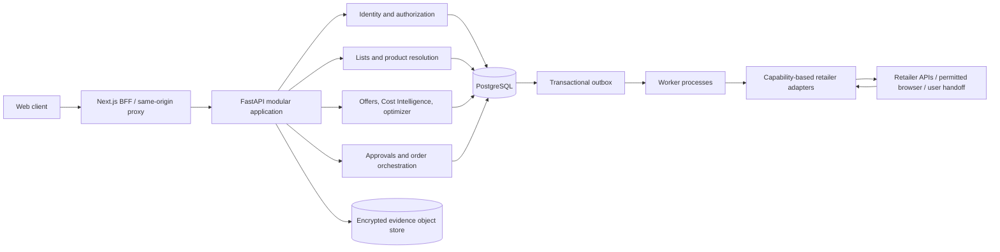
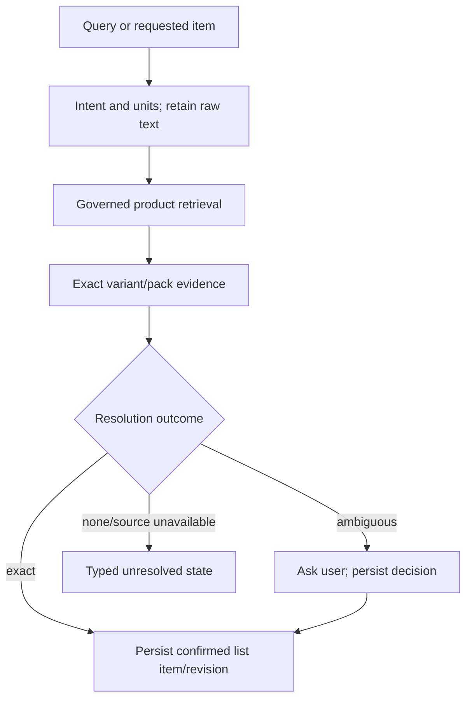
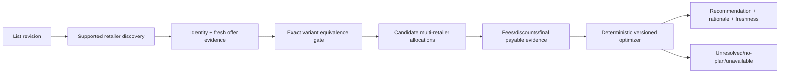
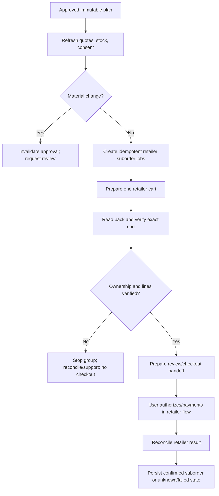
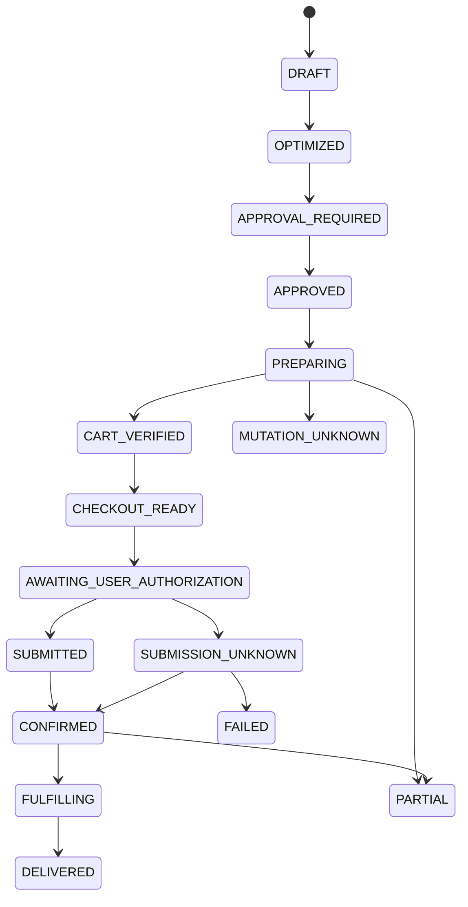
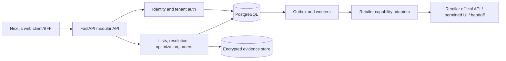
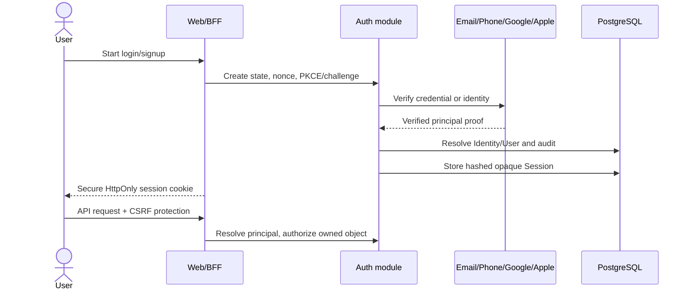
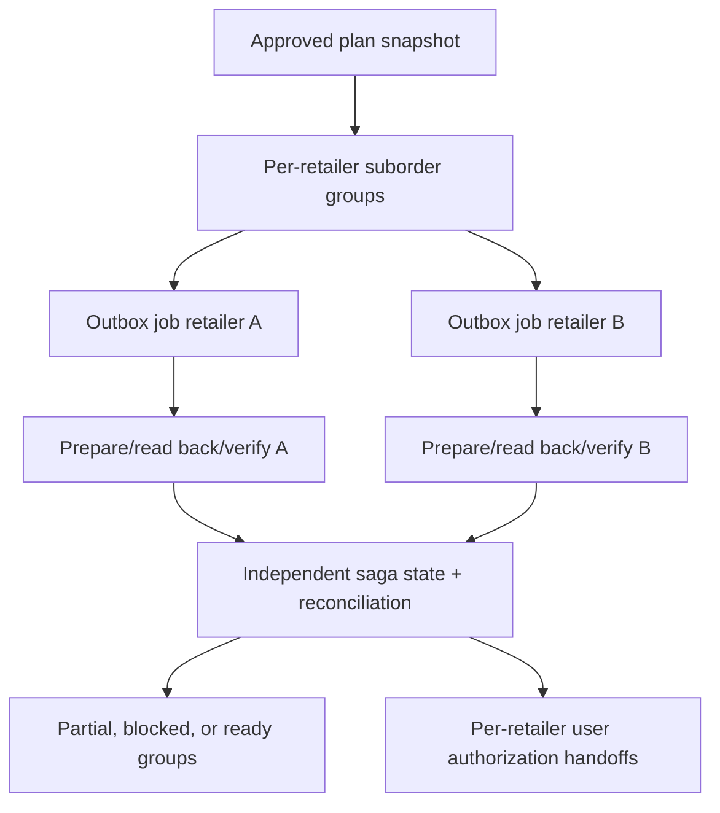
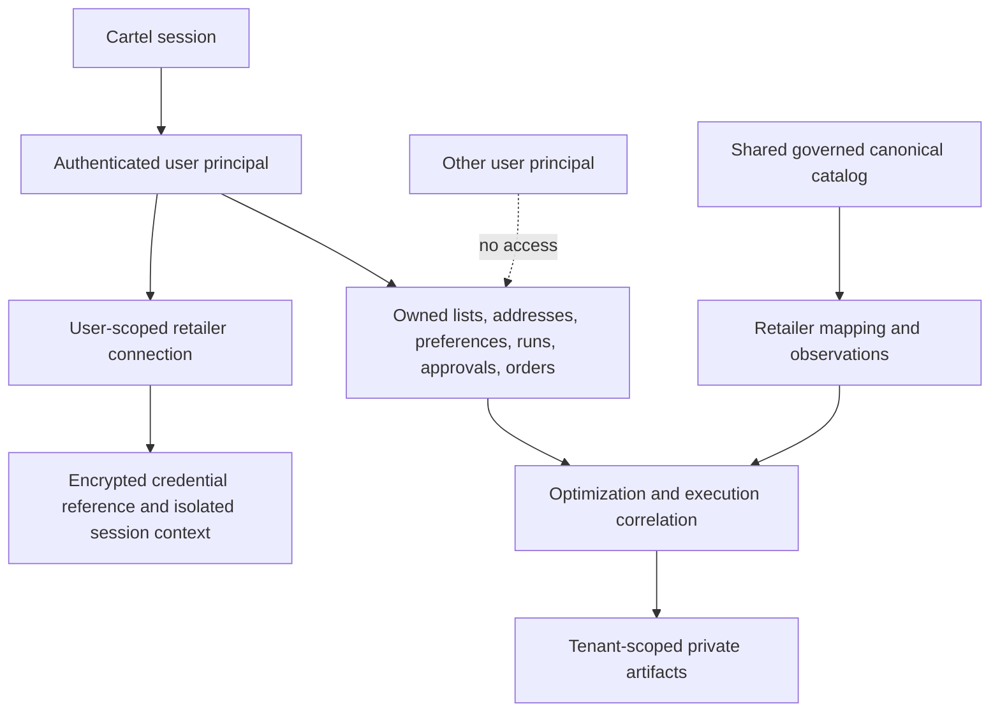

# Cartel Consumer Product Architecture v1.0

**Status:** Authoritative target architecture for the consumer product
**Inspected baseline:** repository rooted at `~/Developer/Cartel-Smart-Cart-Optimizer`; frozen deployment candidate `v0.1.0-deploy.1`
**Scope:** product, domain, runtime, security, migration, and delivery direction beyond the current prototype

This document supersedes `CARTEL_PRODUCT_ARCHITECTURE_v2.0.md` as the architectural source of truth for the product we intend to build. `CARTEL_SHIPPING_STRATEGY_v1.0.md` remains the operating policy for shipping the frozen release until explicitly replaced. Neither document changes existing frozen identity, provenance, optimizer, feasibility, ECE, or fail-closed contracts by implication. Any required contract change needs a reviewed decision, migration plan, and regression evidence.

This is a proposed target, not a capability claim. The inspected repository has no consumer signup, user-owned persistent lists, PostgreSQL domain runtime, multi-retailer live offer comparison, verified live cart-to-checkout execution, Cartel payment, retailer order placement, or order tracking. Interfaces and fixtures are not proof of these capabilities.

## 1. Product Definition

Cartel is a consumer shopping-list optimization and order-orchestration product. The user states what they need once. Cartel resolves exact variants, gathers current evidence from supported retailers, computes and explains a viable allocation, and after approval prepares the retailer carts and checkout flows it is legitimately able to operate. The user completes retailer-required authentication and the final payment/order authorization. Cartel then records retailer-confirmed orders and tracks them where supported.

The primary value is removing repeated list entry and coordination across retailer apps. A user may still have to authorize or pay separately for each retailer. Cartel must not imply one atomic multi-retailer purchase when retailers are independent.

### Frozen UX invariant

Cartel orchestrates retailer order preparation from within one continuous Cartel workflow wherever the retailer's supported integration permits it. The user must not be sent away to manually recreate or coordinate the shopping list in retailer apps. A retailer-controlled authentication or payment surface is a narrow authorization boundary, not a handoff of the shopping workflow: Cartel preserves the plan and progress, returns the user to the corresponding Cartel state, and reconciles the result. External retailer navigation is a capability fallback only when a supported in-workflow path is unavailable; it must be labeled as a reduced capability and must never be presented as the default Cartel experience.

### Product promise

- One account, one durable shopping list, and one orchestration workspace.
- Exact product and pack identity, or a clear question instead of a guess.
- Current, attributable price and availability for the user's delivery context.
- Comparable checkout/effective cost only when supported by sufficiently complete evidence.
- A clear allocation and explanation before any external mutation.
- User approval before cart preparation and user-controlled authorization/payment at the retailer boundary.
- One Cartel-owned orchestration workflow, with retailer-controlled authentication/payment only where required and a correlated return to Cartel.
- Honest partial completion, retry, and order status.

### Non-goals

- Cartel is not a payment processor, wallet, card vault, or UPI PIN/OTP store.
- No order, payment, or irreversible action without the required explicit user authorization.
- No evading CAPTCHA, anti-bot controls, access denials, rate limits, authentication, or retailer terms.
- No promise that every retailer supports every capability or serves every location.
- No silent substitution, hidden unit conversion, fabricated inventory, assumed zero fee, or estimated checkout total presented as fact.
- No microservices, Kubernetes, Redis, or multi-region deployment by default. Add infrastructure only for a demonstrated product/reliability need.

## 2. Repository Baseline: What Exists and What Does Not

The repository has useful deterministic domain layers, but current deployment is a single-instance filesystem-backed prototype/candidate. Current routes are under `/api/v1`; production Compose requires configured bearer tokens and selects checkout capture/observation as `unavailable`.

| Capability | Current repository implementation | Consumer target | Migration required | Priority |
|---|---|---|---|---|
| Authentication | `AUTH_REQUIRED`/`AUTH_TOKENS`, bearer validation in `core/security.py`, `/api/v1/auth/session`; signup page states public signup is unsupported. | Google, Apple, email/password, and phone/OTP on one stable identity/linking model, with verification, recovery, and revocable server sessions. | Replace consumer auth; retain separately scoped operator/service auth. | P0 |
| User/tenant model | No consumer user or ownership tables. Middleware identifies configured token labels; application records are not generally tenant-scoped. | Every private object and retailer connection owned/authorized by a real user. | Add user principal, authorization dependencies, DB constraints, tenant isolation. | P0 |
| Database | SQLAlchemy/Alembic/psycopg/Redis dependencies and empty `backend/app/db` scaffolds; no active PostgreSQL domain repository/migration runtime. | PostgreSQL is source of truth for mutable consumer state. | Implement engine/session, migrations, repositories, transaction boundaries. | P0 |
| Catalog/product identity | `Product`, `ProductVariant`, evidence, deterministic matching/review, filesystem catalog and association stores under `product_intelligence/`. IDs are governed. | Shared governed catalog with exact-variant resolution, review, and retailer-specific mapping. | Preserve IDs/contracts; migrate storage and add consumer resolution workflow. | P0 |
| Ingestion/provenance | Immutable acquisition/parse/normalized observation contracts, artifacts, lifecycle, registries, deterministic workers; filesystem-backed. | Append-only, freshness-aware retailer facts with source and scope. | Add database metadata/object storage and capability-specific source quality. | P1 |
| Retailer coverage | Blinkit acquisition/parser/session code exists; product acquisition is distinct from cart/checkout. BigBasket/Zepto folders are not complete adapters. | Capability-declared, legitimate per-retailer search through tracking integrations. | Prove integration permissions and implement one retailer end-to-end first. | P0 |
| Search | `/api/v1/products/search` retrieves only governed persisted catalog/listing/observation results. | Search intent plus governed canonical product and live permitted retailer offers. | Separate catalog lookup from retailer offer discovery and resolution APIs. | P0 |
| Shopping list/cart | Frontend Zustand store holds a browser-local cart. Backend has `LogicalCart`, resolution and candidate APIs; no saved user lists. | Database-backed lists/revisions; separate user intent from execution carts. | Add list aggregates and API; local store becomes cache. | P0 |
| Candidate planning | Candidate discovery/enrichment/plan construction and `/api/v1/cart/optimize`; explicit deterministic providers/policy. | Durable, user-owned runs over fresh live offers with explicit constraints. | Persist quote/run revisions; retain deterministic plan identity and frozen semantics. | P1 |
| Optimization | Deterministic optimizer, feasibility, ranking, allocation, quantity semantics and contract tests. | Explainable viable allocation including fees, delivery, split limits, and user policies. | Integrate real quotes and policy; change ranking only via versioned decision. | P1 |
| Cost Intelligence | Fee/offer/membership/effective-cost components and checkout observation/ECE pipeline. | Real, comparable quote/checkout payable cost, deferred value separated. | Validate retailer evidence fields/freshness; preserve existing money/ECE semantics. | P1 |
| Cart identity/ownership | Typed `RetailerCartIdentity`, line/snapshot/verifier, strict Blinkit response parser; no proven live Blinkit cart acceptance. | Per-operation verified retailer cart and exact line state. | Implement only behind a proven retailer capability; DB-backed correlation and reconciliation. | P1 |
| Checkout | Generic capture, artifact, registration, provider, fixture integration; production checkout unavailable; Blinkit fail-closed. | Checkout preparation and legitimate retailer authorization handoff. | Implement verified adapter capability; fixtures stay test-only. | P1 |
| Payment | No Cartel payment processor or payment submission. | Retailer-native user authorization/payment only. | Handoff UX and supported retailer contract; never store card/UPI secrets. | P1 |
| Orders/tracking | No consumer order placement, confirmation, history, or tracking system. | Confirmed order groups/events and supported status tracking. | New order domain/state machine, adapter methods, webhook/polling as permitted. | P2 after cart/checkout gate |
| Frontend | Next.js routes for marketing, login/token access, search, local cart, optimize/results/profile/settings. Signup is not functional self-registration. | Consumer onboarding, lists, resolution, offers, approval, execution, orders, account. | Preserve useful UI; migrate auth/state/API contracts. | P0 |
| Jobs/queues | Local ingestion worker/coordinator and APScheduler dependency; no durable consumer order queue/outbox runtime. | Restart-safe quote and orchestration jobs with idempotency. | PostgreSQL outbox + worker leases first; Redis only when justified. | P1 |
| Deployment | Docker Compose frontend proxy, private API network, `cartel-data`, `unless-stopped`; no PostgreSQL container/runtime. | Single-region consumer service with DB, worker, object store, secrets and recovery. | Evolve topology after DB/order acceptance needs; do not imply current setup is multi-user-ready. | P1 |

Current valuable implementation paths include `backend/app/product_intelligence`, `data_ingestion`, `normalization`, `cart_optimization`, `cost_intelligence`, `scrapers/blinkit`, `services`, `api/routes`, `workers`, `frontend/services`, `frontend/store`, and the deterministic integration tests. Preserve their useful contracts, provenance, and rejection behavior rather than rewriting them around new persistence.

## 3. Core Domain and Identity Rules

These identities are separate and must remain so:

1. **User intent:** list and item IDs, raw query, quantity/unit, and user-approved constraints.
2. **Canonical identity:** Cartel-governed `CanonicalProduct` and exact `ProductVariant` IDs.
3. **Retailer identity:** retailer-native product/variant/SKU/listing reference, merchant, and product URL when observed authoritatively.
4. **Observation:** a time/location-scoped fact from a source, with artifact, parser, timestamp, and provenance.
5. **Offer/quote:** a derived view over one or more observations and validity rules; it is not canonical identity or mutable inventory truth.
6. **Optimization decision:** immutable run, policy version, candidate plan, allocation, ECE references, and result.
7. **Retailer execution state:** Cartel operation correlation plus retailer cart/cart-line identity only when the retailer exposes it authoritatively. Browser session identity is not cart identity.
8. **Order state:** Cartel's orchestration record plus retailer-confirmed external order identity/state. A plan, approval, cart, or payment handoff is not an order.

`platform_listing_id` retains its existing Cartel association semantics; it must not be reinterpreted as a retailer ID. `source_index`, product name, array position, or candidate order are never retailer identity. Request and plan identities remain distinct; checkout ownership is correlated by `(request_id, plan_id)`.

## 4. Target System Architecture

Start as a modular monolith using FastAPI and Next.js, plus a separately runnable worker process. Use PostgreSQL for transactional domain state, an encrypted object/blob store for immutable raw artifacts, and a durable DB outbox. A same-origin frontend/BFF provides secure consumer sessions and proxies API calls. Redis is optional for cache/rate-limit/short leases only; it is not order or idempotency authority.



**Boundary rule:** API request handling validates and records intent; workers perform bounded external acquisition/mutations. The database commits a job/outbox record with the state transition before dispatch. Raw or large response bytes do not enter ordinary logs or API payloads.

## 5. Authentication, Sessions, and Authorization

Authentication proves which Cartel principal is present. Authorization checks that principal's rights to an object/action. User ownership is a persistent relationship enforced in every query/transaction. Retailer authentication proves access to a retailer account and is a separate external connection. Retailer browser cookies/session state are not Cartel user credentials and are never shared between users. Payment authorization remains at the retailer boundary.

### Consumer identity design

**Frozen target:** Cartel consumer identity supports Google, Apple, email/password, and phone/OTP, including verification, recovery, and safe account linking. Launch sequencing may phase which providers are enabled, but the stable User/Identity model, linking rules, and session architecture must support all four without a later identity redesign. Provider rollout order is an operational launch decision, not a decision about whether these methods belong in the target product.

- `User`: stable internal ID, account status, locale, created/deleted timestamps, consent/version references.
- `Identity`: provider/issuer plus provider subject; verified email/phone metadata; unique provider subject; lifecycle and last-authenticated timestamps. Email is mutable contact data, not a principal ID.
- **Email/password:** verify ownership before enabling; store only Argon2id password hashes with reviewed parameters; password reset uses single-use, expiring, hashed tokens and neutral responses.
- **Google/Apple:** OIDC with exact redirect allowlists, state, nonce, PKCE where supported, issuer/audience/signature validation, replay protection. Apple relay addresses use ordinary verified-contact rules.
- **Phone/OTP:** SMS/voice provider is an explicit pluggable dependency; OTP is short-lived, one-time, hashed at rest, attempt-limited and rate-limited by IP, account, destination, and device risk. Do not treat phone OTP as long-lived password authentication.
- **Account linking:** link a second identity only after fresh authentication to the existing account plus proof of the new identity. Resolve collisions through recovery, not auto-merge by matching email strings.
- **Recovery:** independent verified channels, risk controls, cooldown, session revocation, and security notification. Support account deletion/export subject to legal retention rules.
- **Sessions:** random high-entropy opaque session secret stored hashed server-side, rotation after login/privilege change, idle/absolute expiry, revocation, device/session list, logout-one/logout-all. Browser uses `Secure`, `HttpOnly`, `SameSite` cookies, narrow scope and CSRF protection. No persistent bearer token in local/session storage in the target product.
- **Abuse controls:** credential stuffing, signup, verification, OTP, recovery, and OAuth callback limits; generic externally visible auth errors; audit without passwords, codes, tokens or provider assertions.

### Session diagram

```mermaid
sequenceDiagram
  actor U as User
  participant C as Browser
  participant B as Next.js BFF
  participant A as Auth service
  participant DB as PostgreSQL
  participant P as Google/Apple/SMS/Email provider
  U->>C: Choose email, phone OTP, Google, or Apple
  C->>B: Start auth with CSRF/state/PKCE context
  B->>A: Create challenge / redirect transaction
  A->>P: Verify or send challenge (provider-specific)
  P-->>A: Verified subject / one-time proof
  A->>DB: Resolve or create User + Identity; record audit
  A->>DB: Store hashed opaque Session
  B-->>C: Set Secure HttpOnly SameSite session cookie
  C->>B: Authenticated same-origin request + CSRF token
  B->>A: Resolve session, principal, revocation and expiry
  A->>DB: Authorize tenant-owned operation
```

### Three separate authorization states

These states must be represented independently in the domain and UX:

1. **Cartel identity:** who the user is in Cartel and which user-owned lists, plans, and orders they may access.
2. **Retailer account connection:** an optional, consented, revocable connection that may let Cartel prepare or inspect that user's retailer cart later, only where legitimately supported. A connection is not approval for a particular purchase.
3. **Purchase authorization:** per-plan approval and any retailer-required checkout authentication/payment authorization. Cartel must obtain fresh approval for the exact plan and material checkout changes; a saved retailer connection never implies purchase or payment consent.

Retailer credential connections use a separate model and key scope: `RetailerConnection(user_id, retailer_id, provider subject, consent, encrypted credential reference, status)`. Retailer secrets/cookies are envelope-encrypted through a KMS-managed key, never used as Cartel login, and accessed only by the matching retailer worker. If retailer auth cannot be integrated within policy, use a supported in-workflow user authorization surface or declare the capability unavailable. Do not make manual recreation in a retailer app the ordinary fallback.

## 6. PostgreSQL Domain Model and User Data

PostgreSQL is the authoritative store for mutable product state and multi-user application state. Use Alembic migrations, explicit transaction boundaries, foreign keys, unique constraints, optimistic version columns, and tenant-scoped repository methods. Keep shared catalog governance distinct from user-owned data. Object storage holds immutable raw/sanitized artifacts; DB stores IDs, digests, classification, expiry, tenant scope, parser version and references.

| Entity/table | Ownership and essential state |
|---|---|
| `users` | Cartel principal, account lifecycle, locale and consent/deletion metadata. |
| `identities` | User FK, provider/issuer/subject or verified contact, verification and link/unlink timestamps. |
| `password_credentials` | User FK and password hash/algorithm metadata only; never plaintext/reset token. |
| `verification_challenges` | Purpose, destination reference, challenge hash, expiry, attempts, consumed/revoked state. |
| `sessions` | User FK, hashed opaque token, issue/expiry/last-seen/revoked, coarse device metadata. |
| `addresses` | User FK, encrypted/minimized delivery address, geocoding/delivery-zone reference and verification state. |
| `user_preferences` | User FK, retailer/membership consent, currency/locale, max splits, substitutions, delivery/time preferences. |
| `retailers` | Shared retailer identity, market and lifecycle. |
| `retailer_capabilities` | Retailer + market + adapter version + capability/status/evidence/expiry/permission record. |
| `retailer_accounts` / `retailer_connections` | User FK, external account reference, consent, credential-vault reference, isolation scope, auth expiry/revocation. No card/UPI data. |
| `shopping_lists` | User FK, name, active/archive, current revision, create/update timestamps. |
| `shopping_list_items` | List FK, stable item ID, original request, normalized intent, quantity/unit, resolution status, confirmed canonical variant, substitution policy, order. |
| `carts` | Cartel execution snapshot derived from a list revision; owner, revision, operation state, not synonymous with retailer cart. |
| `cart_items` | Cart FK, requested/allocated exact canonical variant and quantity, user-approved alternatives if any. |
| `canonical_products` / `product_variants` | Shared governed identity, revision/status, pack/critical attributes, evidence and effective dates. |
| `retailer_listings` | Retailer-native product/variant IDs and references, merchant/zone, explicit association to canonical variant and governance status. Separate Cartel listing ID. |
| `product_matches` | Query/list item, candidate canonical variant/listing, evidence, rule/model version, confidence semantics, reviewer/user decision and outcome. |
| `observations` / `offers` | Append-only source facts: price, availability, quantity/merchant/zone, source artifact/digest, parser, observed/valid times and completeness. Derived offer is versioned, never mutable scraped truth. |
| `optimization_requests` | Owner, list/cart revision, input digest, request ID, policy/catalog versions, idempotency key, status/timestamps. |
| `optimization_plans` | Request FK, deterministic plan ID, feasibility/outcome, ranking/rationale, ECE references, evidence and expiry. Plan ID stays intentionally independent of request ID. |
| `optimization_allocations` | Plan FK, list item, canonical variant, exact quantity, retailer/listing identity, checkout group, provenance. |
| `checkout_sessions` | User + plan + retailer group, checkout preparation state, quote/evidence digest, expiry, retailer handoff reference; never payment secret. |
| `retailer_carts` | User/connection/operation correlation, retailer cart ID only if authoritative, verification state, scope, timestamps and sanitized evidence reference. |
| `retailer_cart_lines` | Retailer cart FK, authoritative retailer product and line IDs if exposed, quantity, expected/observed comparison and provenance. |
| `orders` | Cartel order group and per-retailer suborder parent/state. External order reference only after retailer confirmation. |
| `order_items` | Order FK, exact canonical and retailer product references, quantity and confirmed retailer line/price evidence. |
| `order_events` | Append-only actor/source/state transition, provider event identity, timestamp, provenance and sanitized reason. |
| `order_attempts` | Operation/idempotency key, request digest, attempt count/lease, external outcome/reconciliation state. |
| `idempotency_records` / `outbox_jobs` | Tenant + operation + key uniqueness, payload digest/result, durable dispatch lease and attempt state. |
| `audit_events` | Append-only actor/tenant/object/action/consent/correlation/time/outcome, with restricted access and retention. |

Every user-owned row has a direct or provable `user_id` ownership path. Enforce ownership in application queries and test cross-tenant access; consider row-level security only after principal context propagation is transactionally safe. Do not store sensitive fields inside generic JSON blobs without schema, encryption, and retention controls.

## 7. Shopping Lists, Carts, and Product Resolution

A **shopping list** stores durable intent. A **Cartel cart** is an immutable or versioned execution snapshot. A **retailer cart** is external mutable retailer state. Keep these models distinct. Editing a list increments revision; every resolution, offer snapshot, optimization run, approval, and execution references the exact revision. Editing after approval invalidates the approval.

### Search and exact resolution

1. Accept typed search text or structured product intent. Preserve raw input, requested size/quantity/unit, brand constraints, type/flavor, category, and user qualifiers.
2. Retrieve candidates from the governed canonical catalog and supported retailer search sources. Search ranking only orders candidates; it does not establish identity.
3. Match family, then exact purchasable variant. Verify identity-critical brand, form/flavor, size/net content/count, pack kind, and compatible quantity basis. Multi-packs, variable-weight goods, assortments, and substitutions require explicit rules.
4. Return `EXACT_CONFIRMED`, `NEEDS_USER_CONFIRMATION`, `AMBIGUOUS`, `NO_MATCH`, or `SOURCE_UNAVAILABLE`, with evidence and rule/model/catalog versions. “Confidence” is a calibrated probability only after validation on labeled representative data; otherwise expose score/factors as heuristic, not probability.
5. Only confirmed exact variants enter strict optimization. User-approved substitutions become explicit constraints with their own canonical identity and audit; never alter the original request silently.
6. Persist the user's decision and `ProductMatch`, distinct from retailer listing associations and observations.

### Shopping/product flow diagram



## 8. Retailer Capability and Automation Architecture

Retailer integration is capability-based. A retailer record does not imply all operations are supported. Register capability by retailer, market/zone, account mode, adapter version, policy permission, and last evidence timestamp.

| Capability level | Result required before enabling |
|---|---|
| `DISCOVERY` | Retailer/category/zone coverage and source status. |
| `SEARCH` | Query, pagination/completeness, stable source reference, bounded rate behavior. |
| `PRODUCT_RESOLUTION` | Requested retailer product/variant ID equals retailer-observed ID; exact pack/merchant context. |
| `AVAILABILITY_AND_OFFER` | Fresh stock certainty, price/currency, delivery zone/window, fees/promotions scope, evidence and expiry. |
| `CART_CREATION` | Normal authorized user flow, explicit external cart identity or declared unverifiable, before/after snapshot. |
| `CART_MODIFICATION` | Exact line/product/quantity correlation, ownership, idempotency/reconciliation, contamination policy. |
| `CHECKOUT_PREPARATION` | Verified cart reaches retailer review; totals/components/currency and terms captured without submitting payment/order. |
| `PAYMENT_HANDOFF` | Supported retailer-native redirect/deep link/embedded session with clear user control and return correlation. |
| `ORDER_CONFIRMATION` | Retailer-confirmed external order ID/status; unknown submit is not success. |
| `ORDER_TRACKING` | Authenticated event/polling source, freshness, status mapping and rate limits. |

### Integration tiers

1. **Official API/partner:** preferred. Confirm commercial permission, OAuth scopes, quota, locality/merchant semantics, sandbox/live parity, idempotency, webhook signatures, and data retention.
2. **Legitimately permitted browser flow:** only when terms and access policy allow. Use normal UI, isolated per-user browser context, strict host allowlists, bounded readiness, sanitized evidence and session cleanup. No stealth, CAPTCHA solving, fingerprint changes, undocumented guessed endpoint, or access-control bypass.
3. **User-assisted retailer flow:** use only an authoritative retailer reference and supported handoff. Cartel does not claim cart/checkout/order completion unless it can verify it.
4. **Unavailable/not supported:** return typed capability state. Optimize over other retailers only when the user has permitted partial retailer coverage; otherwise remain unresolved/no-plan.

Adapter operations return typed outcomes (`SUCCESS`, `UNAVAILABLE`, `ACCESS_DENIED`, `RATE_LIMITED`, `OUT_OF_STOCK`, `STALE`, `INVALID_EVIDENCE`, `REQUIRES_USER_ACTION`, `UNKNOWN_OUTCOME`) with retailer, capability/version, `(user_id, operation_id, request_id, plan_id)`, exact native references, zone/merchant, timestamp/expiry, artifact digest/evidence, retryability and sanitized diagnostics. Session ID is not a cart ID; count/name/order is not cart-line identity.

## 9. Cost Intelligence and Multi-Retailer Optimization

### Offer and cost integrity

An offer is a time-, retailer-, merchant-, and delivery-zone-scoped view over observations. Keep source observations append-only. Each offer records product mapping, availability certainty, listing/line price, currency, tax status, package/quantity basis, immediate promotion, delivery promise, fees/minimum spend where known, membership assumption, capture time, freshness deadline, and artifact references.

Preserve current integer-minor-unit `Money`, provenance, ECE identity, and unknown-component contracts. The comparison model separates:

```text
verified immediate payable cost
  = verified checkout item subtotal
  + applicable immediate mandatory fees/taxes
  - applicable immediate discounts

deferred rewards/cashback/points = separate conditional value, never silently netted
```

The retailer's observed final payable total is captured directly. If component reconciliation differs beyond policy tolerance, mark unresolved and show the discrepancy; do not “fix” the retailer total. Missing fees/taxes are unknown, not zero. Currency conversion is a separate timestamped, sourced evaluation. Savings require an explicit comparable baseline and exact same quantities/variant coverage; suppress savings when quotes are stale, currencies/benefits differ, or baseline coverage is incomplete.

### Allocation rules

- Cover every confirmed list line and exact requested quantity unless explicit partial-fill consent exists.
- Allocate only retailer listings mapped to the exact canonical variant with fresh available evidence.
- Respect delivery area/window, merchant/stock scope, retailer basket minimums, fees, order/split cap, membership consent, user exclusions, price tolerance, and substitution constraints.
- Group items only where the retailer's actual cart/merchant boundary permits one checkout. Do not merge across stores/merchants without evidence.
- Checkout-backed ECE is required for a verified payable-cost recommendation. Listing-price ranking may be displayed as a clearly provisional discovery view only; it is not checkout cost or savings.
- Preserve plan identity/tie-breaking, feasibility semantics, and ranking != recommendation. A recommendation requires the selected plan to be feasible, current, and supported by evidence.

### Optimization diagram



## 10. Multi-Retailer Order Orchestration

One logical Cartel execution snapshot may create several independent retailer suborders. Example: requested milk/bread/chicken/detergent/tomatoes may allocate to two retailers only if exact variants, stock, fees, and checkout groups have current evidence. Cartel owns the parent workflow and per-retailer progress; retailer state remains authoritative for external carts/orders.

### Identity and grouping

- `allocation_id` deterministically binds `(optimization_run_id, plan_id, list_item_id, canonical_variant_id, quantity, retailer_id, listing_reference, checkout_group_id)` plus policy/provenance version. It is not an external retailer ID.
- `retailer_order_group_id` is Cartel's stable internal grouping key, scoped to one operation/retailer account/checkout boundary. It is not retailer `cart_id`.
- `retailer_cart_id` and `retailer_cart_line_id` are nullable external authorities; unavailable remains unavailable. An internal replay reference is explicitly named and never passed off as retailer identity.
- For each suborder persist expected lines before side effects, then observed snapshot/evidence. Require exact product IDs/quantities, verified cart context/ownership, and no unexpected or missing lines before checkout preparation.

### Execution policy

1. Freeze approved plan, list revision, quote digests, consent and expiry. Generate stable operation/idempotency keys.
2. Revalidate retailer capability, location, stock, price and freshness. Material price/fee/availability changes trigger a new approval, not a hidden substitution.
3. Prepare each retailer group in bounded sequential execution initially. Parallelize only after adapter isolation and conflict behavior are demonstrated.
4. Read back and verify the complete external cart. If mutation result is ambiguous, reconcile before retry. If identity/ownership is unverifiable, stop that group before payment.
5. Present per-retailer checkout totals and handoff state. User may authorize each retailer separately or cancel; Cartel does not assume cross-retailer atomicity.
6. Persist confirmed groups independently. A failure in one retailer cannot erase, duplicate, or mislabel another group's success.

### Orchestration diagram



### Partial failure, stale data, cancellation, and retry

- If a product becomes unavailable, rerun allocation and ask approval for changed plan; never substitute silently.
- If minimum basket or delivery fees change, refresh and recalculate. New total outside the approved tolerance requires review.
- If one group fails before mutation, other groups may continue only under explicit user policy and show partial state. If some orders are confirmed and another fails, preserve confirmed orders and offer safe next actions.
- User cancellation prevents new work. In-flight calls are reconciled; already created external carts are not automatically cleared unless a proven adapter cleanup contract and user consent authorize it.
- Reads may use bounded retry/backoff respecting `Retry-After`. Non-idempotent cart/order mutations are never blindly retried after timeout; reconcile first. Access denied stops immediately.
- External retailer flows form a saga, not a distributed transaction. Compensation (cart removal/cancel) must be an explicit supported capability, not assumed rollback.

## 11. Checkout and Payment Boundary

Cartel's default boundary is:

```text
Cartel approval -> authorized cart preparation -> verified retailer review
-> hand off to retailer-controlled authorization/payment -> retailer confirmation
```

Possible authorization surfaces vary by capability: (a) same-browser navigation to the retailer's first-party checkout, (b) documented retailer deep link/app link, (c) officially supported embedded checkout or OAuth flow. These are bounded retailer-controlled surfaces inside an otherwise Cartel-owned journey: retain the approved plan and progress, correlate the handoff, and return/reconcile into Cartel. A link that asks the user to rebuild or coordinate the list in a retailer app is a degraded fallback, never the default product experience. A payment provider may be integrated only where retailer/payment contracts explicitly permit it, the user grants the required authorization, and compliance/security review approves. Do not assume availability of any mechanism.

Cartel must never store card PAN/CVV, UPI PIN, payment OTP, or reusable payment credentials. Do not proxy retailer payment pages or collect secrets in Cartel forms. Any retailer authentication session is a separate opt-in connection, encrypted and revocable; it is not payment authorization. “Checkout ready” means verified review data/handoff exists, not that user paid. “Submitted” without retailer confirmation is `ORDER_SUBMISSION_UNKNOWN`, not placed. Only retailer-confirmed evidence creates `CONFIRMED`.

### Checkout/payment diagram

```mermaid
sequenceDiagram
  actor U as User
  participant C as Cartel
  participant R as Retailer
  U->>C: Approve exact plan and quote
  C->>R: Prepare authorized retailer cart
  R-->>C: Verified cart/review totals and handoff reference
  C->>C: Verify ownership, lines, freshness, totals; persist evidence
  C-->>U: Show retailer-specific total and payment boundary
  U->>R: Authenticate, authorize, and pay on retailer surface
  R-->>C: Confirmation/event or no authoritative result
  C->>C: Record confirmed or reconciliation-required state
```

## 12. Order Model and Lifecycle

Parent `Order` is a Cartel orchestration group. Each retailer produces an independent suborder, attempt history, and event stream. Keep expected, submitted, and confirmed states distinct.



Allowed transitions are validated against current state/version and append an audit event. `MUTATION_UNKNOWN` and `SUBMISSION_UNKNOWN` block repeat mutations until reconciliation. Delivery/cancellation/refund statuses require retailer or explicitly labeled user evidence. A parent can be `PARTIAL` while each child remains individually `CONFIRMED`, `FAILED`, `AWAITING_USER_AUTHORIZATION`, or `UNKNOWN`.

Tracking uses signed retailer webhooks where officially available, otherwise authenticated polling within explicit quotas; user-reported status is labeled separately. Store last-observed time and freshness. Provide order history/export and retention/deletion rules. Cartel is not the retailer of record and must state support/escalation boundaries accurately.

## 13. Persistence, Jobs, Idempotency, and Concurrency

- PostgreSQL owns user/list/run/approval/cart/order/job state. `READ COMMITTED` plus explicit row locks or optimistic versions is sufficient for most paths; isolate and document any stronger transaction requirement.
- Write state transition and outbox job in one DB transaction. Workers claim jobs with leases/fencing token, bounded attempts, heartbeat, deadline, cancellation and deterministic backoff. External calls happen outside DB transactions.
- Idempotency key scope is `(user_id, retailer_connection_id, order_group_id, operation, key)`, with request digest. Same key/same payload replays recorded state; same key/different payload conflicts.
- Mutation retries require either retailer-issued idempotency or authoritative reconciliation. Timeouts are unknown outcomes, never automatic permission to replay a non-idempotent side effect.
- Per-user/list revision and per-retailer account locks serialize conflicting cart work. Lease expiry alone cannot allow a stale worker to commit; use fencing/version checks.
- First deployment architecture: Postgres outbox + worker process. Add Redis/queue broker for measured fanout or latency only. Redis is cache/transport, not durable state authority.
- Use encrypted object storage for large raw evidence; digest and immutable metadata in DB. Separate live, test, and fixture artifact namespaces and credentials.

## 14. API and Service Boundaries

Keep FastAPI as a modular application initially. API DTOs are versioned and do not expose ORM models. The Next.js same-origin BFF owns secure browser-session handling and API proxying. All user APIs derive principal from session; never accept a client-supplied owner ID as authorization.

Proposed consumer API families (future, not existing routes):

```text
POST /api/v2/auth/{signup,login,logout,refresh,verify,reset}
GET  /api/v2/me, /api/v2/me/sessions
GET/POST/PATCH /api/v2/lists and /api/v2/lists/{id}/items
GET  /api/v2/products/search
POST /api/v2/product-resolutions
POST /api/v2/retailer-discovery-runs; GET /api/v2/retailer-discovery-runs/{id}
POST /api/v2/optimization-runs; GET /api/v2/optimization-runs/{id}
POST /api/v2/optimization-runs/{id}/approval
POST /api/v2/order-groups/{id}/prepare|resume|cancel
GET  /api/v2/orders and /api/v2/orders/{id}
POST /api/v2/webhooks/retailers/{retailer} (signed-source verification)
```

Long acquisition and execution return durable run/job IDs and typed state; polling or authenticated event updates are user/tenant-scoped. Mutations require idempotency key, list/run revision, request ID, and explicit consent. Error schema separates invalid, unresolved, unavailable, access denied, stale, conflict, unknown mutation, and application failure with safe retry guidance. Never expose stack traces, tokens, cookies, raw retailer HTML, or payment fields.

Current V1 routes (`/products/search`, `/cart/resolve`, `/cart/candidates`, `/cart/plan`, `/cart/optimize`, checkout capture, observations, scrape, health) remain frozen-release APIs. Preserve V1 until client migration, deprecation period and no usage evidence; they do not yet implement consumer V2 semantics.

## 15. Frontend Product Architecture

Target information architecture:

1. Public landing, retailer coverage/limitations, privacy and how checkout/payment works.
2. Signup, provider login, email/phone verification, password recovery, session/device management.
3. Onboarding for delivery address/zone, locale, retailer preferences, memberships and split/substitution policy.
4. Persistent shopping lists with add/search, quantities/units, edit/revision, reuse and archive.
5. Product resolution with exact variant attributes, retailer matches, evidence/freshness, confirmation and explicit alternatives.
6. Offer comparison with stock certainty, listing price versus checkout/effective total, retailer/merchant, delivery window, fees, freshness and unavailable evidence.
7. Optimization review with chosen plan, full allocations, retailer split, rejected alternatives, cost breakdown, savings baseline and quote expiry.
8. Approval plus per-retailer preparation/checkout handoff progress; reapproval on meaningful changes; cancel/reconcile actions.
9. Order history/detail with parent and suborder states, confirmation source, delivery events, partial failure and support path.
10. Account, addresses, connected retailer accounts, memberships, data export/deletion and notification preferences.

Explicit UI states include loading, empty, exact match, confirmation required, unresolved/no-plan, source unavailable, stale/reconfirm, out-of-stock, access denied/rate limited, cart mismatch, checkout unavailable, awaiting retailer authorization, partial completion, submission unknown, confirmed, and tracking stale. No success page based only on HTTP 200 or a non-null optimization object. Never label listing price as checkout total or order as placed without retailer confirmation.

Current frontend `app/`, `services/`, `types/`, `store/`, `apiClient`, Next proxy and reusable components are a starting point. Replace static token login/sessionStorage with secure server-managed sessions; move authoritative cart/list state to backend and invalidate results by list revision. Preserve existing honest unresolved/unavailable UI and adapt, rather than rewrite, components where they match target behavior.

## 16. Eight Required Architecture Diagrams

The diagrams below are compact reference views; detailed constraints are defined in their respective sections.

### 16.1 System architecture



### 16.2 Authentication/session flow



### 16.3 Shopping-list/product-resolution flow


### 16.4 Optimization pipeline


### 16.5 Multi-retailer orchestration



### 16.6 Checkout/payment boundary

```mermaid
sequenceDiagram
  actor U as User
  participant C as Cartel
  participant R as Retailer
  U->>C: Approve exact plan and quote
  C->>R: Prepare authorized retailer cart
  R-->>C: Verified cart/review totals and handoff reference
  C->>C: Verify ownership, lines, freshness, totals; persist evidence
  C-->>U: Show retailer-specific total and payment boundary
  U->>R: Authenticate, authorize, and pay on retailer surface
  R-->>C: Confirmation/event or no authoritative result
  C->>C: Record confirmed or reconciliation-required state
```

### 16.7 Order lifecycle


### 16.8 Data ownership/tenant isolation



## 17. Stage Ownership, Persistence, APIs, Failures, and Evidence

| Stage | Owner / persistent state | API boundary | Failure and retry semantics | Security and evidence |
|---|---|---|---|---|
| Signup/login/recovery | Identity module; User, Identity, Challenge, Session, audit rows. | Auth endpoints; BFF callback. | Challenges expire and are single-use; delivery retries do not replay verification; login abuse is throttled. | Provider proof, verification time, minimal audit; no password/OTP/token log. |
| Onboarding/address | Profile module; encrypted Address, zone resolution, Preferences. | Profile/address APIs. | Invalid/unserved zone is explicit; geocode retry is bounded; never fall back to a neighboring zone. | Address access is user-scoped; provider/source and user confirmation recorded. |
| List edit | Shopping module; list revision/items. | CRUD lists/items with revision/If-Match. | Conflict returns current revision; idempotent create/update keys; no silent overwrite. | Owner from session; original item request preserved. |
| Product resolution | Product-intelligence module; ProductMatch and user decision. | Search/resolve/confirm APIs. | Ambiguous asks; no-match/unavailable stays unresolved; retrieval can retry without changing user choice. | Canonical and retailer IDs separate; identity evidence, matcher/version and human decision. |
| Retailer discovery | Retailer module/worker; job and coverage result. | Async discovery run. | Access denied stops; 429 respects cooldown; missing coverage is not empty inventory. | Capability permission, zone, source, pagination/completeness and timestamp. |
| Offer collection | Retailer adapter + offer service; immutable observations/snapshots. | Quote/offer run. | Safe reads may retry boundedly; stale/failure labeled; conflict does not overwrite history. | Artifact digest/parser/version, retailer ID, merchant/zone, currency, freshness. |
| Equivalence gate | Product Intelligence; mapping decision/revision. | Resolution result consumed by quote/planning. | Critical mismatch excludes listing; user confirmation for ambiguity; never retry-match into silent acceptance. | Attributes, evidence, mapping status and human decision. |
| Cost evaluation | Cost Intelligence; ECE and component evidence. | Optimization service internal/API run. | Missing/malformed totals unresolved; no zero/default/listing fallback. Recompute on fresh evidence. | Checkout/source artifact, component state, currency and evaluation identity. |
| Optimization/recommendation | Planning/optimizer; request, plan, allocation, ECE links. | Create/read optimization run. | Deterministic replay; same key/payload returns same result; stale revision conflicts. No feasible plan is explicit. | Policy/catalog/list versions, candidate coverage, rationale, provenance. |
| User approval | Approval service; immutable consent snapshot. | Approve exact run/plan. | Expiry/change invalidates approval; duplicate approval idempotent; revoke before execution where possible. | User principal, displayed totals/digests, consent version/time and action audit. |
| Cart preparation | Orchestration worker + retailer adapter; expected/observed cart state. | Prepare/resume operation API. | Mutation timeout -> unknown/reconcile; no blind retry; exact lines and ownership required. | Request/plan/operation tuple; authoritative external IDs only; sanitized response evidence. |
| Checkout handoff | Checkout service; CheckoutSession/total snapshot. | Prepare/handoff/read status. | Missing total/identity unavailable; no payment submission. Refresh then reapproval when changed. | Actual checkout artifact, source/timestamp, exact cart correlation. |
| Payment/auth | Retailer-owned surface; Cartel stores only handoff/return correlation. | Redirect/deep link/native supported contract. | Cancel/decline/challenge visible; never auto-retry payment. | User action and retailer return evidence; no card/UPI secret passes through Cartel. |
| Order confirmation | Order service/worker; Order, attempt, event, external ID. | Submit only if supported/authorized; reconcile. | Timeout is submission-unknown; query/reconcile before retry. | Retailer confirmation source/event ID, timestamp, line and total correlation. |
| Tracking | Tracking worker; append-only OrderEvent. | Read order history/details. | Stale/unsupported shown with last-known time; polling bounded and quota-aware. | Signed webhook or authorized polling evidence; user report labeled as such. |

## 18. State, Idempotency, Concurrency, and Recovery Rules

- `request_id`, deterministic `plan_id`, `optimization_run_id`, retailer operation ID, external cart ID, line ID, checkout session ID, and retailer order ID are distinct values.
- Every plan/approval/operation references an immutable list revision, catalog snapshot, quote digests, policy version, and ECE IDs. A changed input creates a new run; it does not mutate old evidence.
- Idempotency key scope is `(user_id, retailer_connection_id, order_group_id, operation, key)`, with request digest. Identical replay returns recorded state; conflicting replay is rejected.
- Record intent and outbox event atomically. Worker leases have a fencing token so stale workers cannot commit after lease loss. Do not hold DB locks across retailer network calls.
- Serialize writes per user cart/list revision and retailer connection. Use bounded per-retailer concurrency. Parallel multi-retailer work is enabled only after each adapter's connection isolation is proven.
- Retry discovery and reads only within adapter rules; respect `Retry-After`. For non-idempotent mutations, timeout/connection loss means unknown outcome, requiring authoritative reconciliation before another mutation.
- No generic automatic compensation. Cart removal, cancellation, and rollback require supported retailer capability, exact target identity and appropriate user consent.
- Partial success is a valid parent outcome. Confirmed child orders remain confirmed when another retailer fails; never replay completed orders as part of parent retry.

## 19. Privacy, Security, and Trust Controls

- **Tenant isolation:** principal derived server-side; ownership predicates on every read/write; FK and uniqueness constraints; cross-user IDOR tests for lists, addresses, matches, runs, artifacts, retailer connections, carts, and orders. Consider PostgreSQL RLS as additional control after safe transaction context.
- **Secrets:** KMS-backed envelope encryption for retailer tokens/cookies and provider secrets, separate keys/purposes, rotation, access audit and revocation. No secrets in source, images, logs, traces, analytics, API responses or support exports.
- **Browser isolation:** separate browser context/profile per user + retailer account + environment. Clear or encrypt context by explicit retention policy. Never infer cart ownership from a browser profile.
- **PII:** collect only address/contact/household data needed for delivery and service; encrypt addresses, constrain support access, retain purpose/timestamps, support correction/export/deletion subject to legal obligations.
- **Payment:** do not receive PAN/CVV, UPI PIN/payment OTP, or reusable payment token. Keep payment on retailer surface. Any exception requires a separately approved payment-provider, PCI/legal and product architecture decision; it is not implied here.
- **Consent:** separately capture account terms, retailer connection, address use, memberships, substitutions, retailer cart preparation, and final payment/order authorization. Approval is bound to exact plan/total/freshness.
- **Audit:** append-only actor/object/operation/result/time/correlation/source events. Redact browser headers, cookies, local storage, device identifiers, raw HTML and payment payloads before persistence.
- **Abuse:** signup/OTP/recovery/search/order rate limits by account, IP, retailer and connection; anomaly detection; circuit breaker and retailer cooldown.
- **Retention:** publish retention for raw artifacts, retailer sessions, address, orders, and audit; make delete/export workflows and legal retention constraints explicit.
- **Operations:** least-privilege database/object-store roles, TLS, encrypted backups, tested restoration, alerting and incident runbooks before real orders.

## 20. Failure Semantics and User Messaging

| State | Meaning and allowed response |
|---|---|
| `EXACT_CONFIRMED` | Exact canonical variant resolved with adequate evidence; may proceed to live discovery. |
| `NEEDS_USER_CONFIRMATION` / `AMBIGUOUS` | User must choose; no optimization as an exact item until resolved. |
| `NO_MATCH` | No eligible identity candidate; retain requested line and allow edit/remove. |
| `UNRESOLVED` | Evidence incomplete/conflicting or required decision/provider is absent; show reasons and next action. |
| `UNAVAILABLE` | Required service/capability is inaccessible/not enabled; distinguish retailer-wide from one operation. |
| `ACCESS_DENIED` / `RATE_LIMITED` | Stop operation, honor policy/cooldown, no bypass or repeated retry. |
| `OUT_OF_STOCK` | Explicit retailer evidence says unavailable now; do not create cart line. |
| `STALE` | Evidence exceeded policy freshness; refresh or request new approval. |
| `NO_PLAN` | No complete allocation satisfies current user constraints. Explain rejected constraints; don't call it optimized. |
| `CART_MISMATCH` / `OWNERSHIP_UNVERIFIABLE` | Stop before checkout/payment. Preserve safe evidence; never clear unrelated user state. |
| `CHECKOUT_UNAVAILABLE` | No verified checkout observation; no checkout-derived ECE/savings. Listing observation stays separate. |
| `MUTATION_UNKNOWN` / `ORDER_SUBMISSION_UNKNOWN` | External operation may have happened; reconcile before retry, never claim failed/placed prematurely. |
| `PARTIAL` | Some retailer suborders are complete/prepared and others failed/pending; show each independently. |
| `PAYMENT_CANCELLED` / `PAYMENT_DECLINED` | Retailer/user result; Cartel stores no payment secret and does not retry payment. |
| `TRACKING_STALE` / `TRACKING_UNSUPPORTED` | Show last authoritative status and time; no invented current status. |

All API results have stable codes, a user-safe message, correlation ID, relevant object IDs, retryability/user action, and evidence freshness. Programming exceptions are not transformed into fabricated success. Fixtures are marked test-only by source and provider wiring and cannot be selected in production.

## 21. Technology Direction

| Technology | Decision |
|---|---|
| FastAPI | Retain for modular API, typed contracts and current integration coverage. Add auth/tenant dependencies and V2 routes without rewriting V1. |
| Next.js | Retain for consumer web and same-origin BFF/proxy. Move auth to secure server-managed sessions and data state to APIs. |
| PostgreSQL | Introduce as required consumer source of truth. Implement SQLAlchemy session, Alembic migrations, transaction-scoped repositories and tested ownership constraints; current scaffolds are not a running DB feature. |
| SQLAlchemy/Alembic | Retain dependencies and scaffold; establish naming, migration discipline, compatibility and rollback gates before domain rollout. |
| Redis | Defer until measured cache, distributed throttle, or queue coordination need. Never sole order/idempotency authority. |
| Background work | Start with PostgreSQL outbox + separate worker process and lease/fencing model. Add broker only for measured workload. |
| Object/blob storage | Add encrypted object storage for large immutable retailer evidence/artifacts; DB retains digest/ownership/retention metadata. Keep local filesystem adapter for tests/dev. |
| Retailer adapters | Introduce per-operation capability interfaces and conformance tests; retain Blinkit code as one adapter-specific acquisition source, not the universal integration contract. |
| Browser automation | Use Playwright only on retailer flows legitimately supported by policy, normal interaction, isolated contexts, bounded operations; access denial means stop. |
| Observability | Structured logs/metrics/traces with request/run/order IDs, adapter capability/outcome and timings; redact all credentials, PII and raw retailer data. |
| Deployment | Evolve from single-host Compose only as DB/worker/object store requirements demand. Avoid platform work that does not unlock list-to-order user value. |

## 22. Migration from Current Cartel

### Retain unchanged unless a concrete decision requires otherwise

- Canonical Product/ProductVariant separation, identity governance, evidence references, deterministic candidate generation/matching and review decisions.
- Ingestion/acquisition provenance, immutable observation/artifact contracts, parser versioning, source identity distinct from Cartel identity.
- Candidate allocation/provenance, deterministic CandidatePlan identity/tie-break semantics, plan ID independent of request ID, declared feasibility, quantity semantics, ranking versus recommendation distinction.
- Money/minor units, checkout observation/ECE provenance, unknown fields, no listing-price fallback, fixture/live evidence isolation, explicit unavailable behavior.
- Cart identity/cart-line/ownership contracts and tests as future adapter requirements; do not claim live support because these contracts exist.

### Refactor and extend

- `backend/app/data_ingestion`, `product_intelligence`, catalog, lifecycle, observation registry and artifact store: add PostgreSQL repositories behind current interfaces; preserve data and digest provenance.
- `backend/app/cart_optimization`, `cost_intelligence`: add persistent immutable run/quote/approval context and fresh offers without changing frozen ranking semantics silently.
- `backend/app/scrapers/blinkit`: isolate current acquisition/parser/session as Blinkit adapter capabilities; preserve fail-closed cart/checkout boundary until retailer evidence and permission support more.
- `backend/app/api/routes`, `main.py`, `core/security.py`: maintain V1 for current release; add principal-scoped consumer V2, rate controls, tenant ownership and DB transaction composition.
- `backend/app/db`, Alembic: implement real engine/session/models/migrations; migrate one domain at a time.
- `frontend/app`, `services`, `types`, `store`, `lib/apiClient.ts`: retain relevant components, replace token/sessionStorage consumer auth, create server-owned list/result/order state, add resolution/review/execution screens.

### Replace/deprecate

- Filesystem mutable stores cease to be source of truth after verified import/cutover; retain immutable artifacts in encrypted object storage or controlled archive.
- Configured `AUTH_TOKENS` is retired for consumer login; keep only restricted service/admin credentials with rotation/audit.
- Browser-local Zustand cart becomes ephemeral cache, not saved-list authority.
- Fixture adapter remains test-only; demos/scripts do not seed live production evidence.
- V1 APIs retire only after client migration, deprecation period and no usage evidence.

### Safe data migration

1. Define target PostgreSQL schema/import manifests and freeze a source snapshot with checksums.
2. Import shared canonical products/variants, associations, observations, artifacts and policy metadata with original IDs/timestamps/provenance; never recalculate identity silently.
3. Reconcile counts, foreign keys, digests, deterministic lookups, duplicate/conflict cases and replay output. Conflicts block cutover.
4. Switch one domain's writes at a time; do not run uncontrolled dual-write. Keep source read-only through rollback window.
5. Do not convert bearer-token labels into users or treat them as verified email/phone. New user data starts only through verified signup/invitation.
6. Validate backup/restore, delete/export and tenant-isolation paths before storing consumer/order data.

## 23. Practical MVP and Implementation Phases

The delivery unit is one usable vertical slice, but retailer feasibility is the first gate, not a late adapter task. Before substantial PostgreSQL/domain implementation or order-orchestration investment, run a bounded, reversible feasibility spike with one candidate retailer and launch zone. Using only authorized interfaces and real evidence, prove the capability chain from search through exact product and availability, cart preparation, checkout preparation, user-controlled payment handoff, and retailer-confirmed order. The spike is not production architecture and must not use fixtures as evidence. If no retailer can legitimately support this chain, pause order-specific investment and make an explicit product/business decision; do not build an order engine around an assumed capability.

Two product milestones are intentionally distinct:

- **Consumer MVP:** a real user can create an account, maintain a persistent shopping list, resolve exact products/variants, see fresh attributable live offers, and receive an explainable optimization over the offers actually available. It is a usable consumer utility, but is not yet the full Cartel orchestration thesis; one retailer does not justify a multi-retailer claim.
- **Cartel Product MVP:** Consumer MVP plus genuine multi-retailer allocation, Cartel-orchestrated retailer cart preparation within one Cartel workflow, checkout handoff, user payment/authorization, retailer-confirmed orders, and a return path to order state in Cartel. This requires at least two order-capable retailer integrations for the multi-retailer claim. Retailer-controlled auth/payment may interrupt the surface briefly, but the user must not manually recreate the shopping list in retailer apps.

The capability spike above is a release-investment gate before either milestone's substantial database/order-domain build. After it passes, the phases below deliver the Consumer MVP first and the Cartel Product MVP through phases 5-7. A one-retailer release may satisfy Consumer MVP gates only; it must not be described as Cartel Product MVP.

| Phase | User-visible capability | Backend / database | Frontend | Retailer / evidence | Tests and release gate | Deliberately unavailable |
|---|---|---|---|---|---|---|
| **0. Retailer feasibility gate (before substantial domain build)** | No public feature; decision whether the target orchestration product is viable for a launch zone. | Throwaway/reversible probe harness only; no order engine or durable consumer schema justified by assumed retailer behavior. | Internal evidence/report only. | One candidate retailer must legitimately demonstrate search, exact identity, availability, cart preparation, checkout preparation, user payment handoff, and retailer-confirmed order. | Written permission/capability basis, real evidence, no bypass, no fixtures; failure pauses order-specific investment and triggers a product decision. | Any unsupported capability; no claim that a retailer is order-capable from search alone. |
| **1. Real account + persistence** | User can sign up/login/recover and see an account on another device. | PostgreSQL and first migrations; User/Identity/Session; provider-neutral model for all four target methods, with email verification and a deliberately phased initial provider rollout; tenant auth dependencies; deploy/migrate/rollback. | Replace token form/sessionStorage with secure cookie auth, signup/recovery/session pages; provider enablement can phase without changing identity/linking design. | No retailer credentials required yet. | Provider security tests, expiry/revocation, auth abuse, cross-user access, restart; no list data leaks. | Retailer connections, purchasing; providers not yet enabled at launch are rollout-disabled, not architecturally unsupported. |
| **2. Persistent list + existing catalog search** | Save/edit a list, return later, add current governed products. | ShoppingList/Item/revision API and repositories; migrate canonical catalog read path; ownership. | Lists, add/search, quantities, empty/unresolved, revision conflicts. | Existing governed search only; label live discovery unavailable. | CRUD/replay, concurrent revision update, tenant IDOR, catalog provenance. | Fresh multi-retailer offers, checkout. |
| **3. Exact resolution + one retailer discovery** | Resolve exact variant with confirmation; see real offers for supported locality. | ProductMatch decisions, retailer capability registry, quote/observation snapshots and freshness. | Resolution comparison/confirm, stock/price timestamp and unavailable states. | One legally supported retailer search/detail/availability capability in one zone; current Blinkit only if access/permission is truly available. | Real authorized evidence acceptance, product/pack mismatch, stale/out-of-stock; no fixture acceptance. | Cart mutation unless independently validated. |
| **4. Real optimization** | User sees explainable best viable plan and alternatives. | Quote-to-candidate integration, ECE/effective cost, immutable optimization runs and policy version. | Cost breakdown, constraints, “why,” no-plan/unresolved. | Add second retailer only when comparable live coverage exists; otherwise no multi-retailer savings claim. | Same cart/zone/currency, replay determinism, fees/discounts, quote expiry and baseline proof. | Order execution until execution adapter passes. |
| **5. Approval + one retailer cart** | User approves a fixed plan; Cartel prepares and verifies one retailer cart. | Approval snapshot, DB outbox, idempotency, cart/line readback, mutation-unknown reconciliation. | Review and approve, progress, reapproval, cancel/reconcile. | One authorized cart creation/modification path with ownership, exact line and isolation proof. | No duplicate add on timeout/replay; contamination/mismatch stops before checkout. | Payment and order submission. |
| **6. Checkout/payment handoff** | Cartel reaches retailer review; user completes retailer auth/payment. | Checkout session and actual fee/final-total capture; consent/handoff correlation. | Per-retailer handoff, total/freshness/changed-price reapproval. | Legitimate native redirect/deep link/embedded capability; no payment bypass. | Test cancel/decline/return, session expiry, changed total, no secret capture. | Cartel payment processing; unsupported retailer checkout. |
| **7. Order confirmation/tracking** | User sees retailer-confirmed order and later status. | Order group/suborders, attempts/events, reconciliation, webhook/polling and support audit. | Orders/history/details/partial state/notifications. | Retailer confirmation and status source with permission. | Unknown submission reconciliation, no duplicate order, signed event/poll freshness. | Unsupported cancellation/refund/payment details. |
| **8. Additional retailers / scale by need** | More coverage and legitimate split-cart ordering. | Adapter conformance, rate budgets, capacity, worker scaling only as measured. | Coverage, preferences, many-suborder progress. | Repeat phases 3-7 per retailer, capability-by-capability. | Per-provider acceptance and failure drills; explicit capability manifest. | Unsupported capabilities stay unavailable. |

### First vertical slice

The first implementation action is the Phase 0 retailer feasibility gate. Once it passes, the fastest Consumer MVP slice is one launch zone/category, persistent account/list, exact-variant resolution, real attributable offers, and explainable optimization; add a second live source before claiming multi-retailer comparison. The Cartel Product MVP then requires at least two legitimate order-capable flows and a continuous Cartel-owned orchestration journey through cart preparation, checkout handoff, and confirmed orders. If retailer permission/access is blocked, Consumer MVP work may continue, but cart/order orchestration remains unavailable and must not be implied.

## 24. Two MVP Definitions of Done

### Consumer MVP

Cartel may be called a Consumer MVP only when all of the following pass with real authorized evidence:

- Real signup/login, verification and recovery work, with the identity architecture supporting Google, Apple, email/password, and phone/OTP even if enablement is phased.
- User profile, address/context, shopping lists, list revisions, preferences, and optimization runs persist in PostgreSQL and are isolated across users.
- User can search/enter intent, resolve exact product variants and quantities, confirm ambiguity, and see why no match is available.
- At least one supported retailer provides fresh, attributable live offers with exact identity, availability, delivery-zone scope, and provenance. Optimization only claims comparisons supported by those offers; a multi-retailer comparison requires at least two comparable live sources.
- Optimizer evaluates real offers and user constraints; recommendation, alternatives, cost breakdown, freshness and evidence are understandable and deterministic. No fabricated checkout cost or savings.
- Secure sessions, cross-user isolation, audit, abuse controls, privacy/export/deletion policy, backup/restore evidence, observability and support handling meet the release baseline.

Consumer MVP deliberately does not claim Cartel Product MVP, retailer cart execution, completed checkout, confirmed orders, or order tracking unless those separate gates below pass.

### Cartel Product MVP

Cartel may be called the end-to-end Cartel Product MVP only when Consumer MVP passes and all of the following are proven:

- At least two legitimate, order-capable retailer integrations support the required launch-zone chain, enabling a real multi-retailer allocation rather than a theoretical split.
- The user approves an immutable, exact plan; Cartel prepares each selected retailer cart inside the same Cartel workflow and verifies exact products, quantities, ownership and checkout context. Any retailer-controlled authentication surface is a narrow boundary; the user never has to manually recreate the list in retailer apps as the normal flow.
- Checkout/payment handoff retains correlation and progress in Cartel, returns the user to the correct Cartel execution state, revalidates material changes, and keeps payment credentials outside Cartel.
- The user separately authorizes/pays through each required legitimate retailer flow. A persistent retailer account connection is never interpreted as per-purchase approval.
- Cartel records each retailer-confirmed order and shows subsequent status from an authorized source; partial multi-retailer completion is represented accurately.
- Retries/idempotency/reconciliation survive API/worker restart, timeouts, 429, stale quotes, partial failure, cancellation, and unknown submit without duplicate mutations/orders.
- Cross-user IDOR, session isolation, retailer credential encryption/revocation, consent/audit, secret redaction, rate limits, data export/deletion policy, backups/restores, alerting and support runbooks have evidence.
- Production acceptance uses consenting real test accounts and live retailer evidence, never fixtures. UI and marketing accurately state unsupported areas.

## 25. Architectural Decisions

1. This document is the target consumer architecture; the shipping strategy remains release-process guidance until replaced.
2. Modular FastAPI + Next.js stays the initial application shape. No service decomposition before a measured need.
3. PostgreSQL is required before multi-user consumer state and retailer orders; filesystem remains development/test/artifact adapter, not tenant authority.
4. Consumer authentication is provider-independent identity + revocable server sessions. Current static bearer auth is transitional/operator-only.
5. Canonical product/variant, retailer-native identity, listing association, observation, quote, plan, cart and order are separate data concepts.
6. Existing deterministic catalog, optimizer, ECE, request/plan correlation and provenance contracts are retained. Semantic changes require versioned decisions and regression/replay review.
7. Retailer feasibility is proven end-to-end for one launch retailer/zone before substantial consumer-domain or order-orchestration implementation; integration remains capability-level, permissioned, isolated and fail-closed.
8. The target consumer identity model supports Google, Apple, email/password, and phone/OTP; launch enablement may phase without changing identity/linking architecture.
9. User approves an immutable plan before cart preparation; a retailer account connection is distinct from per-purchase approval, and final payment/order authorization remains retailer-native and user-controlled.
10. PostgreSQL outbox/worker is the first durable async design; Redis is optional and non-authoritative.
11. Cartel owns one continuous orchestration workflow; retailer navigation is a labeled capability fallback, not the default. Multi-retailer claims require multiple live-capable retailers, not models or fixtures.

## 26. Unresolved Decisions

- Launch metro/zone, initial category set, supported languages/currencies, and exact initial retailer shortlist.
- Which retailers provide official APIs/partner access, what browser automation is permitted, and whether retailer-account connections are acceptable to users.
- Which of the four target auth methods are enabled at initial beta and in what order; provider costs, regional deliverability, account-linking policy and support fallback. The target identity model must support all four.
- Exact address/geocoding provider, storage jurisdiction, KMS/object-store deployment and retention requirements.
- Default substitution/partial-fill policy, max retailers/splits, delivery-window weighting and order-minimum behavior.
- Effective-cost/savings baseline, tax treatment, FX policy, membership and deferred-reward semantics.
- User tolerance for price movement and thresholds that require renewed approval.
- Which supported retailer-controlled auth/payment surface each adapter uses and how the user returns to the correlated Cartel execution state; external app navigation remains a fallback, not the default journey.
- Order support/cancellation/refund responsibility, notifications, retention and account deletion under legal obligations.
- Launch economics, retailer commercial relationships, customer support model and liability disclosures.

## 27. Risks and Dependencies

| Risk/dependency | Consequence | Required mitigation/gate |
|---|---|---|
| Retailer ToS/API permission and access stability | Core automation may be unavailable or disabled without notice. | Written approval/capability review; access denial stops safely; user-assisted alternative only if useful. |
| No verified live Blinkit cart/checkout evidence | Current Blinkit adapter cannot support order preparation. | Do not count it as cart-capable; prove an authorized path or select another retailer. |
| Product/variant matching error | Wrong quantity/type/pack and user harm/trust loss. | Identity-critical attributes, labeled evaluation set, review thresholds, exact confirmation. |
| Price/stock drift and fees | Savings disappear or final payable changes. | Short quote TTL, checkout recapture, reapproval threshold, no hidden fallback. |
| Shared or compromised retailer session | Cross-user orders/address and account compromise. | Per-user isolated contexts, KMS encryption, scope, access audits, revoke/delete flow. |
| Multi-retailer partial execution | Some orders may complete while others fail; no atomic rollback. | Parent/suborder state, explicit partial UX, reconcile unknowns, no blind compensation. |
| Authentication/account recovery abuse | Account takeover and sensitive purchase history exposure. | Threat model, throttles, recovery assurance, session revocation, security review. |
| Address/order PII handling | Privacy/regulatory harm. | Data minimization, residency/retention/legal review, export/delete, incident process. |
| Database migration/recovery | Corrupt/lost lists, identity links or order attempts. | Checksummed import, restore drills, migration rollback and durable outbox tests. |
| External API quotas and retailer schema changes | Stale data or operation failures. | Adapter versioning, contract tests, rate budgets, circuit breakers, alerting. |
| Payment/order semantics differ by retailer | “Ready” may not mean payable/orderable. | Capability-specific UI states and acceptance tests per retailer. |
| Consumer support and third-party fulfillment | Users may attribute retailer issues to Cartel. | Clear support boundaries, confirmation provenance, escalation contacts and accurate status. |

## 28. First 10 Implementation Milestones

1. **Retailer feasibility proof (pre-investment gate):** in one launch zone, prove with one retailer and authorized real evidence the complete search → exact product → availability → cart → checkout preparation → user payment handoff → confirmed order path. Use a bounded reversible spike; no fixtures, access-control bypass, or substantial DB/order-engine build before the go/no-go decision.
2. **Lock launch decisions and threat model:** choose the initial enabled subset/order for the four supported auth methods, retailer permission basis, BFF/session design, account-linking/recovery policy, PII handling, and secret/KMS ownership. Record unsupported retailer capabilities explicitly.
3. **PostgreSQL foundation:** after Gate 0 passes, implement settings/engine/session, Alembic first migration, health/readiness and integration-test DB fixture; no product model duplication yet.
4. **User/Identity/Session vertical slice:** verified signup/login/logout/recovery, provider-neutral model for Google, Apple, email/password and phone/OTP, phased provider enablement, secure cookie, CSRF, revocation, audit and cross-user authorization tests.
5. **Global catalog importer:** migrate canonical product/variant, associations, observations, and provenance with checksums/reconciliation; keep filesystem source read-only for rollback.
6. **Persistent list APIs and UI:** create/edit/revise lists across devices; authorize every row; replace browser-local cart as source of truth.
7. **Exact product resolution UX:** connect list item intent to existing deterministic catalog/matching/review; confirmation, ambiguity and no-match states; collect labeled correction evidence.
8. **First retailer live offer capability:** implement one permitted search/product/availability/price adapter in one zone with bounded freshness and sanitized evidence; acceptance is real live evidence, not fixture.
9. **Consumer MVP optimization:** bind list revision + quote snapshots to existing planner/ECE/optimizer; show alternatives, source times, unknowns and correct baseline. Require a second retailer before any multi-retailer comparison claim.
10. **Cartel Product MVP execution:** prove at least two order-capable retailer flows through approved allocation, Cartel-orchestrated cart preparation, correlated retailer authorization/payment handoff, confirmed orders, return to Cartel, and partial-failure reconciliation.

The ten milestones separate a usable Consumer MVP (through milestone 9) from the full Cartel Product MVP (milestone 10). Order tracking depth, additional retailers, and scale follow only after legitimate confirmation/reconciliation is proven. The order/payment boundary must not be skipped to make an early demonstration appear complete.

---

**Final constraint:** Cartel owns user intent, canonical governance, comparison policy, optimization decisions and orchestration history. Retailers own their accounts, carts, payment authorization, accepted orders, fulfillment and authoritative order status. Cartel may coordinate these systems only to the extent each retailer capability is authorized and verifiable; everything else remains explicitly unavailable.
