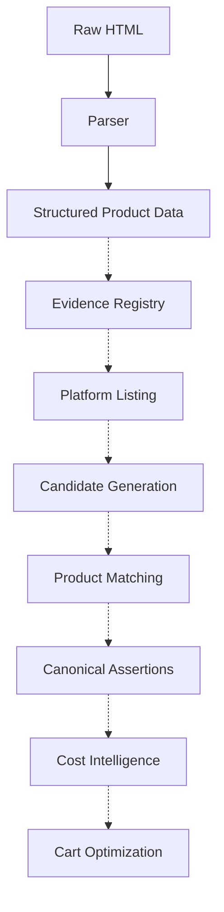

# Cartel

**Cartel calculates what you'll actually pay for groceries — not what the app shows you.**

Effective-cost intelligence and cart optimization across quick-commerce platforms.


> Compare effective cost, not sticker prices.

<!-- Replace with screenshot/GIF once Cost Intelligence is implemented -->

---

## Why This Exists

Every grocery price-comparison tool compares the same thing: the price printed on the product.

That number is often incomplete.

What you actually pay depends on:

* Delivery fees
* Handling charges
* Platform fees
* Membership pricing
* Cashback
* Coupon stacking rules
* Minimum-order thresholds
* Free-item promotions

Research across Blinkit, BB Now, Zepto, Instamart, and JioMart confirmed a fundamental reality:

> The cart is the unit of optimization, not the product.

Comparing products in isolation misses the fees, offers, and thresholds that only resolve at checkout.

Cartel exists to answer a single question:

> **What does this cart actually cost right now on each platform?**

---

## What Makes Cartel Different

|                          | Typical Price Comparison Tools | Cartel                          |
| ------------------------ | ------------------------------ | ------------------------------- |
| Optimization unit        | Single product                 | Whole cart                      |
| Compared value           | Displayed price                | Effective cost                  |
| Delivery / handling fees | Ignored                        | Modeled                         |
| Coupons & cashback       | Ignored                        | Modeled                         |
| Offer stacking           | Ignored                        | Modeled                         |
| Location-aware pricing   | Rare                           | Built in                        |
| Product matching         | Heuristic                      | Deterministic & evidence-backed |
| Auditability             | Limited                        | Replayable                      |

---

## Current Status

### ✅ Completed

#### Data Acquisition

* FastAPI backend
* Modular scraper architecture
* Blinkit browser automation
* Location-aware persistent sessions
* Raw extraction pipeline

#### Product Intelligence Foundation

* Canonical product schema
* Product domain models
* Matching architecture
* Governance contracts

#### Research

* Cross-platform pricing systems
* Offer mechanics
* Fee structures
* Cart optimization approaches
* Consumer pricing behavior

---

### 🚧 In Progress

#### Product Intelligence

* Evidence registry
* Candidate generation
* Product matching
* Review workflows
* Canonical assertion updates

#### Cost Intelligence

* Offer modeling
* Promotion-rule modeling
* Fee modeling
* Platform-pricing intelligence

---

### 📋 Planned

* Zepto integration
* BB Now integration
* Instamart integration
* JioMart integration
* Effective-cost engine
* Cart optimization
* Cart splitting
* Public APIs
* Dashboard
* Frontend application

---

## Screenshots & Demo

Cartel is currently focused on backend systems and product intelligence.

Visual demos will be added as major milestones ship.

Planned demonstrations:

* Evidence registry output
* Candidate generation output
* Product matching decisions
* Canonical assertion creation
* Effective-cost comparisons
* Cart optimization recommendations

---

## Quick Start

Clone the repository:

```bash
git clone <repo-url>
cd Cartel-Smart-Cart-Optimizer/backend
```

Create environment variables:

```bash
cp .env.example .env
```

Install dependencies:

```bash
pip install -r requirements/dev.txt
```

Run migrations:

```bash
alembic upgrade head
```

Or start everything with Docker:

```bash
docker compose up
```

---

## Run Existing Product Intelligence Demos

The product-intelligence pipeline already runs against real Blinkit data.

```bash
python scripts/demo_evidence_registry.py
python scripts/demo_candidate_generation.py
python scripts/demo_product_matching.py
```

---

## Example Outputs

The following stages are already executable today:

### Evidence Registry

```text
✓ Raw product extracted
✓ Evidence bundle created
✓ Content hash generated
✓ Bundle persisted
```

### Candidate Generation

```text
Input Product
    ↓
Candidate Discovery
    ↓
Ranked Candidate List
```

### Product Matching

```text
Candidate Evaluation
    ↓
Variant Analysis
    ↓
Match Decision
    ↓
Canonical Assertion
```

---

## Design Principles

Cartel prioritizes:

* Deterministic behavior over probabilistic guesses
* Evidence before assertions
* Reproducibility over convenience
* Cart-level optimization over product-level comparison
* Auditability over black-box decisions

Every major system is designed to be explainable, replayable, and reviewable.

---

## Architecture Overview



**Solid nodes** represent implemented systems.

**Dashed nodes** represent systems under active development.

---

## Example Workflow

Target experience after Cost Intelligence and Cart Optimization ship:

1. User submits a grocery cart.
2. Cartel retrieves live platform pricing.
3. Fees, promotions, rewards, and thresholds are evaluated.
4. Effective cost is calculated for each platform.
5. Cartel identifies the cheapest purchasing strategy.
6. Cart splitting is recommended when beneficial.

---

## Dataset

Current repository data includes:

### Blinkit

* Raw HTML captures
* Structured product records
* Evidence bundles
* Multiple grocery categories

Data exists primarily to support development and validation of product-intelligence systems.

---

## Repository Structure

```text
Cartel-Smart-Cart-Optimizer/
├── backend/
├── data/
├── docs/
├── scripts/
├── frontend/
├── infra/
├── ml/
├── docker-compose.yml
└── LICENSE
```

### Key Directories

| Directory | Purpose                                    |
| --------- | ------------------------------------------ |
| backend/  | FastAPI backend and intelligence engine    |
| data/     | Raw, normalized, and evidence data         |
| docs/     | Architecture and governance specifications |
| scripts/  | Demonstrations and utilities               |
| frontend/ | Future frontend work                       |
| infra/    | Infrastructure planning                    |
| ml/       | Future experimentation                     |

---

## Documentation

The repository contains extensive architecture and governance documentation covering:

* Product intelligence
* Evidence registry design
* Candidate generation
* Product matching
* Assertion governance
* Cost intelligence planning
* Platform integration strategy

See the `docs/` directory for details.

---

## Testing

Run tests:

```bash
pytest
```

Current coverage focuses on:

* Variant candidate evaluation
* Product matching logic
* Product-intelligence foundations

Coverage will expand as additional systems become operational.

---

## Roadmap

| Phase | Focus                               | Status |
| ----- | ----------------------------------- | ------ |
| 1     | Data Acquisition                    | ✅      |
| 2     | Product Intelligence Foundation     | ✅      |
| 3     | Product Intelligence Implementation | 🚧     |
| 4     | Cost Intelligence                   | 🚧     |
| 5     | Cart Optimization                   | 📋     |
| 6     | Platform Expansion                  | 📋     |
| 7     | Consumer Experience                 | 📋     |

---

## Use Cases

### Consumers

* Compare actual grocery costs across platforms
* Evaluate membership value
* Understand fee and promotion impact

### Researchers

* Study pricing systems
* Analyze promotion mechanics
* Investigate platform behavior

### Developers

* Build pricing applications
* Integrate effective-cost intelligence
* Extend platform coverage

### Future Integrators

* Budgeting applications
* Cashback platforms
* Financial tools
* Shopping assistants

---

## Why Developers Star This Project

Cartel focuses on problems that are usually ignored:

* Effective-cost modeling instead of sticker-price comparison
* Cart-level optimization instead of product-level comparison
* Deterministic matching instead of opaque heuristics
* Replayable audit trails instead of trust-based results
* Evidence-backed assertions instead of undocumented decisions

Additionally:

* Real Blinkit acquisition is already implemented
* Product-intelligence systems are executable today
* Architecture emphasizes reproducibility and governance
* Every major decision path is designed to be inspectable

---

## Contributing

Cartel is still early in development.

Before opening large pull requests:

1. Open an issue first.
2. Discuss architectural implications.
3. Align with existing governance principles.

Areas currently most open to contribution:

* Platform integrations
* Product intelligence
* Documentation
* Testing
* Cost intelligence

Detailed contribution guidelines will be published in `CONTRIBUTING.md`.

---

## License

MIT
