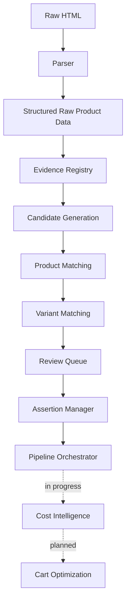

<div align="center">

<br/>

# 🛒 Cartel

### Cartel calculates what you'll *actually* pay for groceries — not what the app shows you.

**True effective-cost intelligence and cart optimization across quick-commerce platforms.**

<br/>

[](https://github.com/neural-agi/Cartel-Smart-Cart-Optimizer)
[](LICENSE)
[](https://github.com/neural-agi/Cartel-Smart-Cart-Optimizer)
[](https://github.com/neural-agi/Cartel-Smart-Cart-Optimizer/tree/main/backend/tests)

<!-- TODO: Add CI badge once GitHub Actions is set up -->
<!-- TODO: Add terminal GIF of demo_product_matching.py once captured -->

<br/>

**[🤔 Why This Exists](#-why-this-exists) · [✨ What Makes It Different](#-what-makes-it-different) · [🏗 Architecture](#-architecture-overview) · [🚀 Quick Start](#-quick-start) · [🗺 Roadmap](#-roadmap) · [🤝 Contributing](#-contributing)**

</div>

---

## 🤔 Why This Exists

Every grocery price-comparison tool compares the same thing: the price printed on the product. That number is mostly fiction.

What you *actually* pay depends on delivery fees, handling charges, platform fees, cashback, loyalty pricing, coupon stacking rules, minimum-order thresholds, membership pricing, and free-item promotions that activate or expire depending on what's already in your cart.

Research across **Blinkit, BB Now, Zepto, Instamart, and JioMart** confirmed the problem is structural, not incidental:

- **The cart is the unit of optimization, not the product.** Comparing item prices in isolation misses fees and thresholds that only resolve at checkout.
- **Identical products are represented differently across platforms** — naive price-scraping silently compares the wrong things.
- **Offer eligibility is conditional** — activation rules, expiry windows, and stacking limits change what a price actually means.
- **Pricing is engineered to be hard to compare.** Anchoring, urgency, and free-delivery thresholds are deliberate, not accidental.

Cartel exists to answer one question honestly:

> *"What does this cart actually cost, right now, on each platform?"*

---

## ✨ What Makes It Different

|  | Typical Price Comparison Tools | Cartel |
|---|---|---|
| **Optimization unit** | Single product | Whole cart |
| **What's compared** | Displayed price | Effective cost (price + fees − rewards) |
| **Delivery / handling / platform fees** | Ignored | Modeled explicitly |
| **Coupons, cashback, loyalty pricing** | Ignored | Modeled explicitly |
| **Offer stacking & thresholds** | Ignored | Modeled explicitly |
| **Location-aware pricing** | Rare | Built in |
| **Product matching** | Manual / fuzzy | Deterministic, evidence-backed, replayable |
| **Matching decisions** | Opaque | Full audit trail per decision |

---

## 🏛 Core Principles

Cartel is built around a few non-negotiable principles that experienced engineers will recognize immediately.

- **Deterministic by design** — given identical governed inputs, the system produces identical outputs every time
- **Replayable decisions** — every matching and pricing decision can be reproduced and inspected, not just trusted
- **Evidence-backed reasoning** — every match traces back to the raw source data that justified it
- **Fail-closed validation** — invalid inputs are rejected explicitly rather than silently degraded
- **Immutable audit trails** — decision records are append-only and tamper-evident
- **Explicit governance contracts** — matching rules are declared, versioned, and enforced, not implicit
- **Explainable matching** — the system can always answer *why* it matched two products, not just *that* it did

---

## 🎯 Target Experience

> *This is the full intended workflow once Cost Intelligence and Cart Optimization ship. See [Current Status](#-current-status) for what runs today.*

```
You provide a grocery list
          │
          ▼
Cartel pulls live prices, fees & active offers
across every connected platform for your location
          │
          ▼
Runs each platform's offer stack against your cart
(thresholds · coupons · cashback · loyalty pricing)
          │
          ▼
You get actual effective cost per platform
+ a split recommendation if buying across
  platforms is cheaper than buying from one
```

---

## 🔬 Product Intelligence Pipeline

The complete product intelligence pipeline is Cartel's biggest technical achievement — and every step is deterministic.

```
Evidence Registry
      │
      ▼
Candidate Generation
      │
      ▼
Product Matching
      │
      ▼
Variant Matching
      │
      ▼
Review Queue
      │
      ▼
Assertion Manager
      │
      ▼
Pipeline Orchestrator
      │
      ▼
Cost Intelligence  ← next
```

Given identical governed inputs, this pipeline produces identical candidate generation, matching, review, assertion, and audit results every time. That's an uncommonly rare property in data systems, and it's intentional.

---

## 🏗 Architecture Overview



> **Solid lines** = built, integrated, and tested (Data Acquisition through complete Product Intelligence pipeline).
> **Dashed lines** = contracts exist, implementation actively underway.
> **Dotted** = designed, not yet started.

**Component breakdown:**

| Component | Role | Status |
|---|---|---|
| **Parser / Scraper** | Blinkit browser automation with location-aware persistent sessions | ✅ |
| **Evidence Registry** | Content-addressed, hash-keyed records of every raw source that informed a product match | ✅ |
| **Candidate Generation** | Deterministic ranked candidate pool for each product query, configurable strategies | ✅ |
| **Product Matching** | Deterministic matching with governance contracts, audit records, rationale chains | ✅ |
| **Variant Matching** | Deterministic variant-level matching with full audit trail | ✅ |
| **Deterministic Review Queue** | Lifecycle-managed review pipeline for governed matching decisions | ✅ |
| **Deterministic Assertion Manager** | Revision history, supersession, and canonical state management | ✅ |
| **Pipeline Orchestrator** | Coordinates the complete deterministic product intelligence pipeline end-to-end | ✅ |
| **Offer & Cost Intelligence** | Models fees, promotions, cashback, stacking rules into effective cost | 🚧 |
| **Cart Optimization** | Recommends cheapest full cart including cross-platform splits | 📋 |

---

## 📊 Current Status

### ✅ Data Acquisition — Complete
- FastAPI backend, modular scraper architecture
- Blinkit browser automation, location-aware persistent sessions
- Raw extraction pipeline
- *(BigBasket and Zepto scraper modules scaffolded, not yet implemented)*

### ✅ Product Intelligence Foundation — Complete
- Canonical product schema + domain models
- Matching architecture + governance contracts
- Deterministic matching framework

### ✅ Research — Complete
- Cross-platform pricing analysis
- Offer system, fee structure, and cart optimization research
- Consumer pricing behavior research

### ✅ Product Intelligence — Complete
- Evidence Registry
- Deterministic Candidate Generation
- Deterministic Product Matching
- Deterministic Variant Matching
- Deterministic Review Queue
- Deterministic Assertion Manager
- End-to-end Product Intelligence Orchestrator
- Audit trails & replayable decision records
- Canonical assertion pipeline

### 🚧 Cost Intelligence — Active Development
- Checkout observation
- Cost context
- Offer modeling
- Fee modeling
- Platform pricing intelligence

### 📋 Planned
- Platform expansion — Zepto, BB Now, JioMart, Instamart
- Optimization engine — true-cost calculation, cart optimization, cart-splitting
- Consumer experience — public APIs, dashboard, frontend

---

## 🚀 Quick Start

### Prerequisites
- Python 3.10+
- Docker (optional but recommended)

### Install

```bash
git clone https://github.com/neural-agi/Cartel-Smart-Cart-Optimizer.git
cd Cartel-Smart-Cart-Optimizer/backend
cp .env.example .env
# Edit .env — see docs/setup.md for required variables
pip install -r requirements/dev.txt
alembic upgrade head
```

Or with Docker:

```bash
docker compose up
```

### Run the Pipeline Demos

The product intelligence pipeline runs against **real scraped Blinkit data** — no API keys or browser automation needed:

```bash
python scripts/demo_evidence_registry.py
python scripts/demo_candidate_generation.py
python scripts/demo_product_matching.py
```

> Raw Blinkit HTML and structured JSON across **8 product categories** (milk, bread, rice, atta, biscuits, chips, soft drinks, shampoo) are included in `data/`.

### Run Tests

```bash
pytest backend/tests/ -v
```

---

## 📡 API Endpoints

| Method | Endpoint | Description |
|---|---|---|
| `GET` | `/health` | Health check |
| `GET` | `/api/v1/...` | v1 routes (see `backend/app/api/v1/`) |

Full API docs available at `http://localhost:8000/docs` once the backend is running.

---

## 📁 Repository Structure

```
Cartel-Smart-Cart-Optimizer/
│
├── backend/
│   ├── app/
│   │   ├── main.py
│   │   ├── api/                      # FastAPI routers — v1, health, dependencies
│   │   ├── core/                     # config, logging, security
│   │   ├── db/                       # SQLAlchemy base/session + models (Alembic-managed)
│   │   ├── normalization/            # pricing / products / units normalization
│   │   ├── product_intelligence/     # the core engine
│   │   │   ├── evidence/             # evidence registry — interfaces, service, storage
│   │   │   ├── candidate_generation/ # ranking, strategies, service
│   │   │   ├── matching/             # product + variant matching logic
│   │   │   ├── assertions/           # deterministic assertion manager — revision history, supersession, canonical state
│   │   │   ├── review/               # deterministic review queue — lifecycle management
│   │   │   └── orchestrator/         # end-to-end pipeline orchestration
│   │   └── scrapers/
│   │       ├── blinkit/              # fully implemented — parser, scraper, session
│   │       ├── bigbasket/, zepto/    # scaffolded stubs — not yet implemented
│   │       └── base/, utils/
│   ├── tests/
│   └── requirements/, alembic.ini, Dockerfile, .env.example
│
├── data/
│   ├── raw/blinkit/                  # scraped HTML + metadata, 8 product categories
│   ├── cleaned/blinkit/              # structured JSON output
│   └── product_intelligence/
│       └── evidence/blinkit/         # content-addressed evidence bundles (hash-keyed)
│
├── docs/                             # 40+ architecture and governance specifications
├── scripts/                          # demo scripts + data extraction utilities
├── frontend/, infra/, ml/            # long-horizon scaffolding — not yet implemented
└── docker-compose.yml, LICENSE
```

---

## 📈 Project Metrics

- **40+** architecture and governance specifications written before implementation
- **Deterministic** end-to-end product intelligence pipeline
- **Replayable** audit trail for every matching and assertion decision
- **8 product categories** of real Blinkit production data included in the repository
- **7-stage** product intelligence pipeline from evidence to canonical assertion

---

## 📚 Documentation

The `docs/` directory contains **40+ architecture and governance specifications** written before implementation — covering canonical product modeling, evidence corpus analysis, matching architecture, variant matching contracts, production safety reviews, and pathological scenario analysis.

**Key starting points:**

| Doc | What It Covers |
|---|---|
| `docs/product_intelligence_design.md` | Overall product intelligence design |
| `docs/product_intelligence_pipeline.md` | Pipeline architecture |
| `docs/product_matching_architecture.md` | Matching system design |
| `docs/variant_matching_architecture.md` | Variant matching in depth |
| `docs/canonical_product_schema.md` | The cross-platform product model |
| `docs/research_analysis.md` | Cross-platform pricing research findings |

---

## 👥 Who This Is For

**End users** *(once the consumer experience ships)* — anyone who buys groceries across Blinkit, Zepto, Instamart, or BigBasket and wants the actual cheapest option before checking out.

**Developers and contributors** — engineers interested in deterministic matching systems, quick-commerce data infrastructure, offer modeling, or building additional platform integrations.

**Researchers and analysts** — anyone studying quick-commerce pricing behavior, platform fee structures, or behavioral pricing mechanisms in Indian e-commerce.

---

## 🎯 Current Focus

Building **Cost Intelligence**.

The completed Product Intelligence pipeline identifies and matches products deterministically across platforms. The next milestone is deterministic modeling of:

- Checkout observations
- Delivery and handling fees
- Platform-specific offer rules
- Membership and loyalty pricing
- Cashback and reward stacking
- Effective cost per cart

This unlocks true cart optimization — the core promise of the project.

---

## 🗺 Roadmap

| Phase | Focus | Status |
|---|---|---|
| 1 | Data Acquisition — Blinkit scraper, session management, raw extraction | ✅ Complete |
| 2 | Product Intelligence Foundation — schemas, domain models, matching architecture | ✅ Complete |
| 3 | Product Intelligence Implementation — evidence registry, candidate generation, matching | 🚧 Active |
| 4 | Cost Intelligence — offer engine, fee modeling, effective-cost calculation | 🚧 Active |
| 5 | Cart Optimization — multi-platform comparison, cart splitting, cheapest-cart recommendation | 📋 Planned |
| 6 | Platform Expansion — Zepto, BB Now, JioMart, Instamart | 📋 Planned |
| 7 | Consumer Experience — public APIs, dashboard, frontend | 📋 Planned |

---

## 🤝 Contributing

Cartel is early — architecture decisions are still being made, and contributing now shapes the foundation.

**Ground rules:**
- **Open an issue before a large PR** so design decisions stay consistent with existing governance contracts
- **Tests are required** — PRs that reduce coverage don't merge
- **Read the relevant `docs/` spec** before contributing to a module — it saves significant back-and-forth

**Best entry points for contributors right now:**

| Area | Why It's Accessible |
|---|---|
| 🌐 **Platform scrapers** (Zepto, BB Now, JioMart, Instamart) | Base contracts are defined — well-scoped, clear interface |
| 🧪 **Test coverage** | Always welcome across all modules |
| 📚 **Documentation** | `CONTRIBUTING.md` + `docs/setup.md` in progress — contributions welcome |
| 🔍 **Product Intelligence** | Evidence registry, candidate generation, and matching are all active |

A full `CONTRIBUTING.md` with development setup, environment variable documentation, architecture orientation, and extension guides is coming shortly. In the meantime, open an issue and ask.

---

## 💡 Vision

> *"What is the cheapest way to buy my entire grocery cart right now?"*

Across platforms, locations, offers, memberships, rewards, and delivery constraints — not as an approximation, but as a number you can trust.

Most price-intelligence tools optimize the easy thing: the sticker price. Cartel is being built to model the hard thing: the real economics of a grocery purchase, end to end, with every decision auditable and every result reproducible.

---

## 📄 License

MIT — see [LICENSE](LICENSE).

---

<div align="center">

Built by [@neural-agi](https://github.com/neural-agi)

[](https://github.com/neural-agi/Cartel-Smart-Cart-Optimizer)
[](https://github.com/neural-agi/Cartel-Smart-Cart-Optimizer/fork)
[](https://github.com/neural-agi/Cartel-Smart-Cart-Optimizer)

</div>
