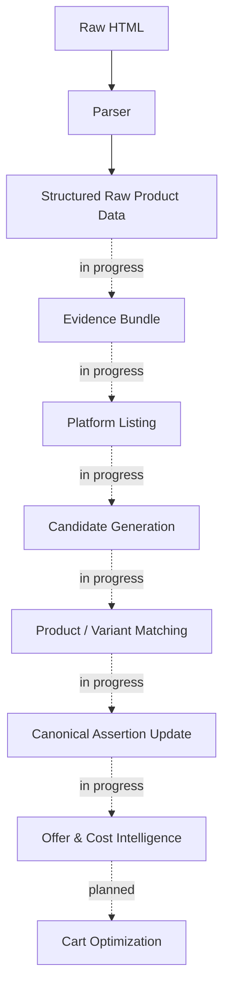

# Cartel

**Cartel calculates what you'll actually pay for groceries — not what the app shows you.**

True effective-cost intelligence and cart optimization across quick-commerce platforms.


<!-- TODO: Add CI badge once GitHub Actions is set up -->
<!-- TODO: Add terminal GIF of demo_product_matching.py once captured -->

---

## Why This Exists

Every grocery price-comparison tool compares the same thing: the price printed on the product. That number is mostly fiction.

What you actually pay depends on delivery fees, handling charges, platform fees, cashback, loyalty pricing, coupon stacking rules, minimum-order thresholds, membership pricing, and free-item promotions that activate or expire depending on what's already in your cart.

Research across Blinkit, BB Now, Zepto, Instamart, and JioMart — India's quick-commerce delivery apps — confirmed the problem is structural, not incidental:

- **The cart is the unit of optimization, not the product.** Comparing item prices in isolation misses fees and thresholds that only resolve at checkout.
- **Identical products are represented differently across platforms**, so naive price-scraping silently compares the wrong things.
- **Offer eligibility is conditional** — activation rules, expiry windows, and stacking limits change what a price actually means.
- **Pricing is engineered to be hard to compare.** Anchoring, urgency, and free-delivery thresholds are deliberate, not accidental.

Cartel exists to answer one question honestly: *what does this cart actually cost, right now, on each platform?*

## What Makes It Different

| | Typical Price Comparison Tools | Cartel |
|---|---|---|
| **Optimization unit** | Single product | Whole cart |
| **What's compared** | Displayed price | Effective cost (price + fees − rewards) |
| **Delivery / handling / platform fees** | Ignored | Modeled explicitly |
| **Coupons, cashback, loyalty pricing** | Ignored | Modeled explicitly |
| **Offer stacking & thresholds** | Ignored | Modeled explicitly |
| **Location-aware pricing** | Rare | Built in |
| **Product matching** | Manual / fuzzy | Deterministic, evidence-backed, replayable |
| **Matching decisions** | Opaque | Full audit trail per decision |

## Key Features

> 🚧 Cartel is mid-build. The features below describe the system being constructed — see **Current Status** for the exact line between what runs today and what's in progress.

- **True effective-cost modeling** — price, fees, and rewards collapsed into the number you actually pay.
- **Cart-level optimization** — the whole basket, not item-by-item guesswork.
- **Deterministic, evidence-backed product matching** — every match traces back to the raw source data that justified it, and re-running it produces the same result.
- **Location-aware pricing** — the same product can cost differently a few kilometers away; Cartel models that instead of ignoring it.
- **Replayable audit trails** — every matching and pricing decision can be reproduced and inspected, not just trusted.
- **Offer stacking intelligence** — activation thresholds, expiry windows, and platform-specific stacking constraints modeled as first-class rules.

## Architecture Overview



*Solid = live today (Blinkit scraping → structured product data). Dashed = contracts and architecture exist, implementation actively underway. Dotted = designed, not yet started.*

**Components:**
- **Parser / Scraper** — Blinkit browser automation with location-aware persistent sessions.
- **Evidence Bundle** — content-addressed, hash-keyed records of every raw source that informed a product match.
- **Candidate Generation** — ranked candidate pool for each product query, with configurable strategies.
- **Product / Variant Matching** — deterministic matching with governance contracts, audit records, and rationale chains.
- **Canonical Assertions** — the authoritative cross-platform product record, updated from matched evidence.
- **Offer & Cost Intelligence** — models fees, promotions, cashback, and stacking rules into effective cost. *(In progress)*
- **Cart Optimization** — recommends the cheapest full cart, including cross-platform splits. *(Planned)*

## Current Status

**✅ Completed**
- Data Acquisition — FastAPI backend, modular scraper architecture, Blinkit browser automation, location-aware persistent sessions, raw extraction pipeline. *(BigBasket and Zepto scraper modules are scaffolded, not yet implemented.)*
- Product Intelligence Foundation — canonical product schema, domain models, matching architecture, governance contracts, deterministic matching framework
- Research — cross-platform pricing analysis, offer system research, fee structure research, cart optimization research, consumer pricing behavior research

**🚧 In Progress**
- Product Intelligence Implementation — evidence registry, candidate generation, product matching, variant matching, review workflow, canonical assertion updates
- Cost Intelligence — offer modeling, promotion-rule modeling, fee modeling, platform-pricing intelligence

**📋 Planned**
- Platform expansion — Zepto, BB Now, JioMart, Instamart
- Optimization engine — true-cost calculation, cart optimization, cart-splitting, multi-platform recommendations
- Consumer experience — public APIs, dashboard, frontend application

## End-to-End Workflow

*This is the target experience once Cost Intelligence and Cart Optimization ship. See Current Status above for what's running today.*

1. You provide a grocery list.
2. Cartel pulls live prices, fees, and active offers across every connected platform for your location.
3. It runs each platform's offer stack against your specific cart — thresholds, coupons, cashback, loyalty pricing.
4. You get the actual effective cost per platform, plus a split recommendation if buying across platforms is cheaper than buying from one.

## Who This Is For

**As an end user** (once the consumer experience ships) — anyone who buys groceries across Blinkit, Zepto, Instamart, or BigBasket and wants to know the actual cheapest option before checking out.

**As a developer or contributor** — engineers interested in deterministic matching systems, quick-commerce data infrastructure, offer modeling, or building out additional platform integrations.

**As a researcher or analyst** — anyone studying quick-commerce pricing behavior, platform fee structures, or behavioral pricing mechanisms in Indian e-commerce.

## Installation

```bash
git clone <repo-url>
cd Cartel-Smart-Cart-Optimizer/backend
cp .env.example .env
# Edit .env — see docs/setup.md for required variables and what each one does
pip install -r requirements/dev.txt
alembic upgrade head
```

Or use Docker:

```bash
docker compose up
```

## Quick Start

The product intelligence pipeline runs against real scraped Blinkit data today — no API or browser automation needed:

```bash
python scripts/demo_evidence_registry.py
python scripts/demo_candidate_generation.py
python scripts/demo_product_matching.py
```

These run the evidence, candidate-generation, and matching layers directly against the data already in `data/`. Raw Blinkit HTML and structured JSON across 8 product categories (milk, bread, rice, atta, biscuits, chips, soft drinks, shampoo) are included in the repository.

To run the full test suite:

```bash
pytest backend/tests/ -v
```

## Repository Structure

```
Cartel-Smart-Cart-Optimizer/
├── backend/
│   ├── app/
│   │   ├── main.py
│   │   ├── api/                      # FastAPI routers — v1, health, dependencies
│   │   ├── core/                     # config, logging, security
│   │   ├── db/                       # SQLAlchemy base/session + models (Alembic-managed)
│   │   ├── normalization/            # pricing / products / units normalization
│   │   ├── product_intelligence/     # the core engine
│   │   │   ├── evidence/             # evidence registry — interfaces, service, storage
│   │   │   ├── candidate_generation/ # ranking, strategies, service
│   │   │   ├── matching/             # most complete module — product + dedicated variant_* logic
│   │   │   ├── assertions/           # canonical assertion interfaces and types
│   │   │   └── review/               # contracts only — review workflow not yet implemented
│   │   ├── scrapers/
│   │   │   ├── blinkit/              # fully implemented — parser, scraper, session
│   │   │   ├── bigbasket/, zepto/    # scaffolded stubs — not yet implemented
│   │   │   └── base/, utils/
│   │   └── schemas/, services/, workers/
│   ├── tests/                        # unit tests — variant candidate evaluation
│   └── requirements/, alembic.ini, Dockerfile, .env.example
├── data/
│   ├── raw/blinkit/                  # scraped HTML + metadata, 8 product categories
│   ├── cleaned/blinkit/              # structured JSON output
│   └── product_intelligence/
│       └── evidence/blinkit/         # content-addressed evidence bundles (hash-keyed)
├── docs/                             # 40+ architecture and governance specifications
├── scripts/                          # demo_evidence_registry.py, demo_candidate_generation.py,
│                                     # demo_product_matching.py, extract_blinkit_raw.py,
│                                     # run_blinkit_search.py
├── frontend/, infra/, ml/            # long-horizon scaffolding — README placeholders only,
│                                     # no implementation yet
└── docker-compose.yml, LICENSE
```

## Documentation

The `docs/` directory contains 40+ architecture and governance specifications written before implementation — covering canonical product modeling, evidence corpus analysis, matching architecture, variant matching contracts, production safety reviews, and pathological scenario analysis.

Key starting points:
- `docs/product_intelligence_design.md` — overall product intelligence design
- `docs/product_intelligence_pipeline.md` — pipeline architecture
- `docs/product_matching_architecture.md` — matching system design
- `docs/variant_matching_architecture.md` — variant matching in depth
- `docs/canonical_product_schema.md` — the cross-platform product model
- `docs/research_analysis.md` — cross-platform pricing research findings

## Roadmap

| Phase | Focus | Status |
|---|---|---|
| 1 | Data Acquisition — Blinkit scraper, session management, raw extraction | ✅ |
| 2 | Product Intelligence Foundation — schemas, domain models, matching architecture, governance | ✅ |
| 3 | Product Intelligence Implementation — evidence registry, candidate generation, matching | 🚧 |
| 4 | Cost Intelligence — offer engine, fee modeling, effective-cost calculation | 🚧 |
| 5 | Cart Optimization — multi-platform comparison, cart splitting, cheapest-cart recommendation | 📋 |
| 6 | Platform Expansion — Zepto, BB Now, JioMart, Instamart | 📋 |
| 7 | Consumer Experience — public APIs, dashboard, frontend | 📋 |

## Contributing

Cartel is early — architecture decisions are still being made, and contributing now shapes the foundation, not just adds to it.

- **Open an issue before a large PR** so design decisions stay consistent with existing governance contracts.
- **Platform integrations** (Zepto, BB Now, JioMart, Instamart) are well-scoped and the most accessible way to contribute — scraper base contracts are already defined.
- **Product Intelligence** is the active focus — evidence registry, candidate generation, and matching are all in progress.

A full `CONTRIBUTING.md` with development setup, environment variable documentation, architecture orientation, and extension guides is coming shortly. In the meantime, open an issue and ask.

## Vision

Enable consumers to answer one question with confidence:

> "What is the cheapest way to buy my entire grocery cart right now?"

Across platforms, locations, offers, memberships, rewards, and delivery constraints — not as an approximation, but as a number you can trust.

Most price-intelligence tools optimize the easy thing: the sticker price. Cartel is being built to model the hard thing: the real economics of a grocery purchase, end to end, with every decision auditable and every result reproducible.

## License

MIT
