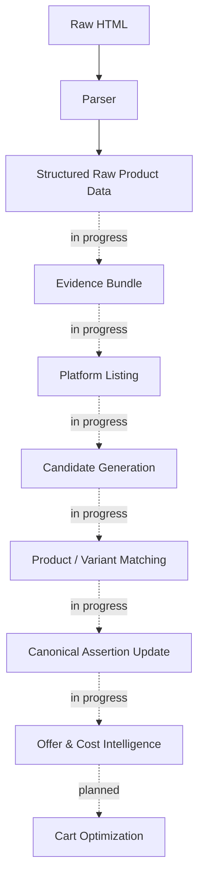

# Cartel

**Cartel calculates what you'll actually pay for groceries — not what the app shows you.**

Effective-cost intelligence and cart optimization across quick-commerce platforms.


<!-- TODO: hero screenshot/GIF — e.g. "displayed price vs. effective cost" side-by-side once Cost Intelligence ships -->

---

## Why This Exists

Every grocery price-comparison tool compares the same thing: the price printed on the product. That number is mostly fiction.

What you actually pay depends on delivery fees, handling charges, platform fees, cashback, loyalty pricing, coupon stacking rules, minimum-order thresholds, membership pricing, and free-item promotions that activate or expire depending on what's already in your cart.

Research across Blinkit, BB Now, Zepto, Instamart, and JioMart — India's quick-commerce delivery apps — confirmed the problem is structural, not incidental:

- **The cart is the unit of optimization, not the product.** Comparing item prices in isolation misses fees and thresholds that only resolve at checkout.
- **Identical products are represented differently per platform**, so naive price-scraping silently compares the wrong things.
- **Offer eligibility is conditional** — activation rules, expiry windows, and stacking limits change what a price actually means.
- **Pricing is engineered to be hard to compare.** Anchoring, urgency, and free-delivery thresholds are deliberate, not accidental.

Cartel exists to answer one question honestly: *what does this cart actually cost, right now, on each platform?*

## What Makes It Different

| | Typical Price Comparison Tools | Cartel |
|---|---|---|
| **Optimization unit** | Single product | Whole cart |
| **What's compared** | Displayed price | Effective cost (price + fees − rewards) |
| **Delivery / handling / platform fees** | Ignored | Modeled explicitly |
| **Coupons, cashback, loyalty pricing** | Ignored | Modeled explicitly |
| **Offer stacking & thresholds** | Ignored | Modeled explicitly |
| **Location-aware pricing** | Rare | Built in |
| **Product matching** | Manual / fuzzy | Deterministic, evidence-backed, replayable |

## Key Features

> 🚧 Cartel is mid-build. These describe the system being built and what's already running — see **Current Status** below for the exact line between the two.

- **True effective-cost modeling** — price, fees, and rewards combined into the number you actually pay.
- **Cart-level optimization** — the whole basket, not item-by-item guesswork.
- **Deterministic, evidence-backed product matching** — every match traces back to the raw source data that justified it, and re-running it produces the same result.
- **Location-aware pricing** — the same product can cost differently a few kilometers away; Cartel accounts for that instead of ignoring it.
- **Replayable audit trails** — every matching and pricing decision can be reproduced and inspected, not just trusted.
- **Built for offer reality** — thresholds, expiry windows, stacking limits, and membership pricing modeled as first-class rules, not edge cases.

## Architecture Overview



*Solid = live today (Blinkit scraping → structured product data). Dashed = architecture and contracts exist, implementation actively underway. Dotted = designed, not started.*

## Current Status

**✅ Completed**
- Data Acquisition — FastAPI backend, modular scraper architecture, Blinkit browser automation, location-aware persistent sessions, raw extraction pipeline (Blinkit fully implemented; BigBasket and Zepto scraper modules are scaffolded but not yet built out)
- Product Intelligence Foundation — canonical product schema, domain models, matching architecture, governance contracts
- Research — cross-platform pricing, offer systems, fee structures, cart optimization, consumer pricing behavior

**🚧 In Progress**
- Product Intelligence — evidence registry, candidate generation, product/variant matching, review workflow, canonical assertion updates
- Cost Intelligence — offer modeling, promotion-rule modeling, fee modeling, platform-pricing intelligence

**📋 Planned**
- Platform expansion — Zepto, BB Now, JioMart, Instamart
- Optimization engine — true-cost calculation, cart optimization, cart-splitting, multi-platform recommendations
- Consumer experience — public APIs, dashboard, frontend application

## Example Workflow — Where This Is Headed

*(Not live yet — this is the target experience once Cost Intelligence and Cart Optimization ship. See Current Status above for what's actually running today.)*

1. You add your usual grocery list as a cart.
2. Cartel pulls live prices, fees, and active offers across every connected platform.
3. It calculates the real effective cost of *your exact cart* on each platform — not the sticker price.
4. You get a ranked answer, including a cart split if that turns out cheaper than buying everything in one place.

## Installation

```bash
git clone <repo-url>
cd Cartel-Smart-Cart-Optimizer/backend
cp .env.example .env
pip install -r requirements/dev.txt
alembic upgrade head
```

Or skip local setup entirely — `docker compose up` from the repo root.

## Quick Start

The product intelligence pipeline already runs against real scraped data — no API needed to see it work:

```bash
python scripts/demo_evidence_registry.py
python scripts/demo_candidate_generation.py
python scripts/demo_product_matching.py
```

These run the evidence, candidate-generation, and matching layers directly against the Blinkit data already sitting in `data/`.

## Repository Structure

```
Cartel-Smart-Cart-Optimizer/
├── backend/
│   ├── app/
│   │   ├── main.py
│   │   ├── api/                    # FastAPI routers — v1, health, dependencies
│   │   ├── core/                   # config, logging, security
│   │   ├── db/                     # SQLAlchemy base/session + models (Alembic-managed)
│   │   ├── normalization/          # pricing / products / units normalization
│   │   ├── product_intelligence/   # the core engine
│   │   │   ├── evidence/           # evidence registry — interfaces, service, storage
│   │   │   ├── candidate_generation/
│   │   │   ├── matching/           # most built-out module — includes dedicated variant_* logic
│   │   │   ├── assertions/
│   │   │   └── review/             # contracts only — review workflow itself not implemented yet
│   │   ├── scrapers/
│   │   │   ├── blinkit/            # implemented — parser, scraper, session
│   │   │   ├── bigbasket/, zepto/  # scaffolded stubs, not built yet
│   │   │   └── base/, utils/
│   │   └── schemas/, services/, utils/, workers/
│   ├── tests/                      # unit tests — currently covers variant candidate evaluation
│   └── requirements/, requirements.txt, alembic.ini, Dockerfile, .env.example
├── data/
│   ├── raw/blinkit/                 # scraped HTML + metadata across 8 product categories
│   ├── cleaned/blinkit/             # structured JSON output
│   └── product_intelligence/evidence/blinkit/  # content-addressed evidence bundles (hash-keyed)
├── docs/                            # 40+ architecture & governance specs — heavy focus on variant matching
├── scripts/                         # demo_evidence_registry.py, demo_candidate_generation.py, demo_product_matching.py, extract_blinkit_raw.py, run_blinkit_search.py
├── frontend/, infra/, ml/           # scaffolded — README only, no implementation yet
└── docker-compose.yml, LICENSE
```

## Roadmap

| Phase | Focus | Status |
|---|---|---|
| 1 | Data Acquisition | ✅ |
| 2 | Product Intelligence Foundation | ✅ |
| 3 | Product Intelligence Implementation | 🚧 |
| 4 | Cost Intelligence | 🚧 |
| 5 | Cart Optimization | 📋 |
| 6 | Platform Expansion (Zepto, BB Now, JioMart, Instamart) | 📋 |
| 7 | Consumer Experience (APIs, dashboard, frontend) | 📋 |

## Screenshots / Demo

No UI yet — Cartel is currently backend and data-pipeline work. A side-by-side of "displayed price vs. effective cost" is the natural first visual once Cost Intelligence lands.

## Use Cases

- **Budget-conscious households** comparing real costs across quick-commerce apps before checkout.
- **Anyone juggling multiple grocery apps** trying to figure out which one is actually cheapest *this week* — not by sticker price.
- **Researchers and analysts** studying platform pricing, promotion design, and behavioral pricing patterns.
- **Future integrators** — fintech, cashback, and budgeting apps wanting accurate effective-cost data via API.

## Why Developers Star This Project

- It tackles the actually hard part of price comparison — fee and offer modeling — instead of stopping at scraped sticker prices.
- Deterministic, evidence-backed matching means results are reproducible and auditable, not best-effort guesses.
- The cart-as-optimization-unit framing is a genuinely different approach from typical comparison tools.
- Real production data acquisition (Blinkit) is already running — this isn't a paper architecture.
- The matching logic has been through real adversarial review: 40+ internal docs covering pathological scenarios, production-safety review, and governance consistency audits — for variant matching alone.

## Contributing

Cartel is early and the architecture is still settling — open an issue before a large PR so design decisions stay consistent.

- Check **Current Status** above for what's actively being built (Product Intelligence, Cost Intelligence).
- Platform integrations (Zepto, BB Now, JioMart, Instamart) are well-scoped if you want to take one on.
- Detailed contribution guidelines are coming as the project matures.

## Vision

Enable consumers to answer one question with confidence:

> "What is the cheapest way to buy my entire grocery cart right now?"

Across platforms, locations, offers, memberships, rewards, and delivery constraints — not in theory, but as a number you can trust.

## License

MIT
